---
## Front matter
lang: ru-RU
title: Лабораторная работа №1. Управление версиями.
author: |
	Alexander S. Baklashov
institute: |
	RUDN University, Moscow, Russian Federation

date: 21 September, 2023

## Formatting
toc: false
slide_level: 2
theme: metropolis
header-includes: 
 - \metroset{progressbar=frametitle,sectionpage=progressbar,numbering=fraction}
 - '\makeatletter'
 - '\beamer@ignorenonframefalse'
 - '\makeatother'
aspectratio: 43
section-titles: true
---

# Цель работы

– Изучить идеологию и применение средств контроля версий.

– Освоить умения по работе с git.

# Выполнение лабораторной работы

## Установка gh в Fedora Linux

Установим gh в Fedora Linux

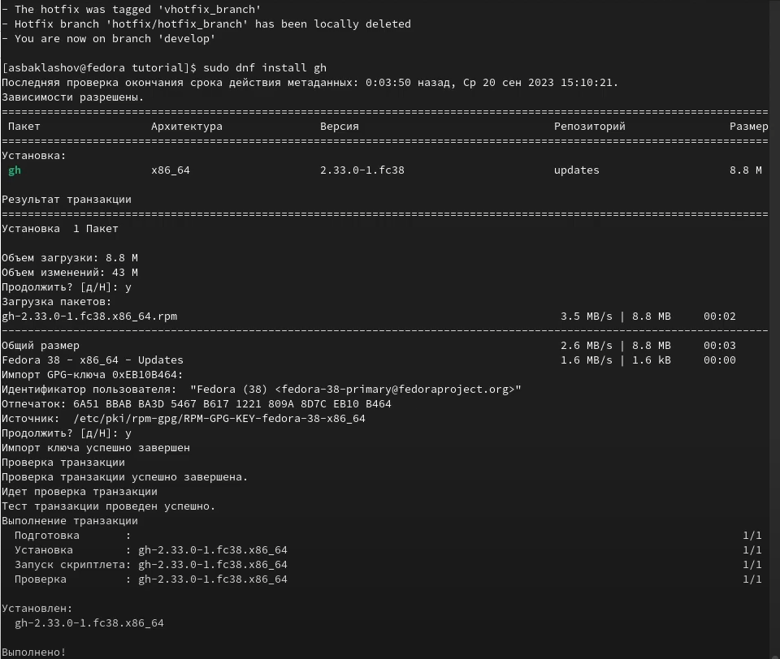{ #fig:001 width=70% }

## Базовая настройка git

Зададим имя и email владельца репозитория

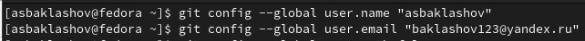{ #fig:002 width=90% }

Зададим имя начальной ветки, параметр autocrlf, параметр safecrlf.

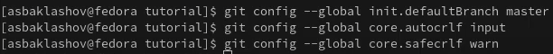{ #fig:003 width=90% }

## Создание ключей ssh

Создадим ключ ssh по алгоритму rsa с ключём размером 4096 бит.

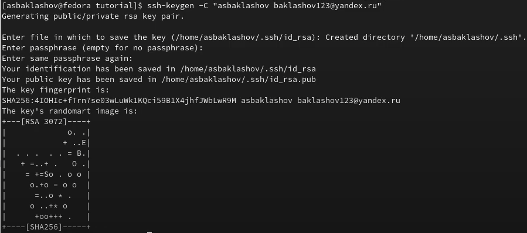{ #fig:004 width=90% } 

## Создание ключей ssh

Создадим ключ ssh по алгоритму ed25519

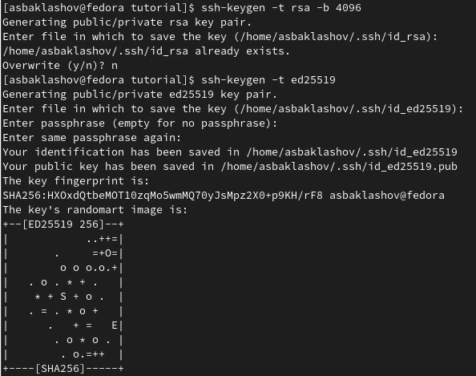{ #fig:005 width=70% }

## Создание ключа GPG

Сгенерируем ключ с определёнными параметрами

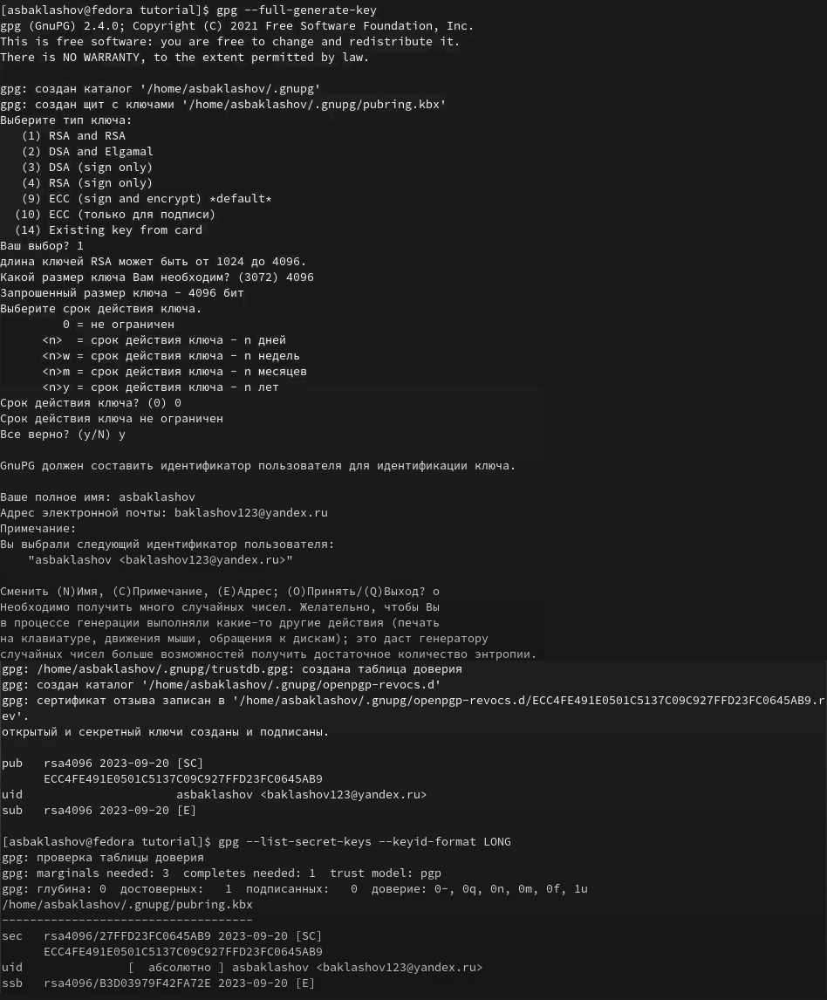{ #fig:006 width=50% }

## Добавление GPG ключа в GitHub

Выведем список ключей и копируем отпечаток приватного ключа

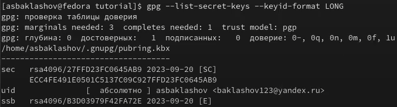{ #fig:007 width=90% }

## Добавление GPG ключа в GitHub

Cкопируем сгенерированный GPG ключ в буфер обмена

{ #fig:008 width=90% }

## Добавление GPG ключа в GitHub

Перейдём в настройки GitHub, нажмём на кнопку New GPG key и вставим полученный ключ в поле ввода.

{ #fig:009 width=90% }

## Настройка автоматических подписей коммитов git

Используя введённый email, укажем Git применять его при подписи коммитов

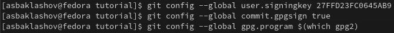{ #fig:010 width=90% }

## Настройка gh

Совершим настройку gh

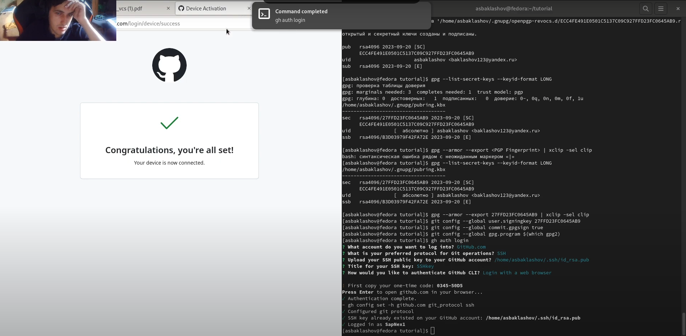{ #fig:011 width=90% }

## Шаблон для рабочего пространства

Создадим репозиторий курса на основе шаблона 

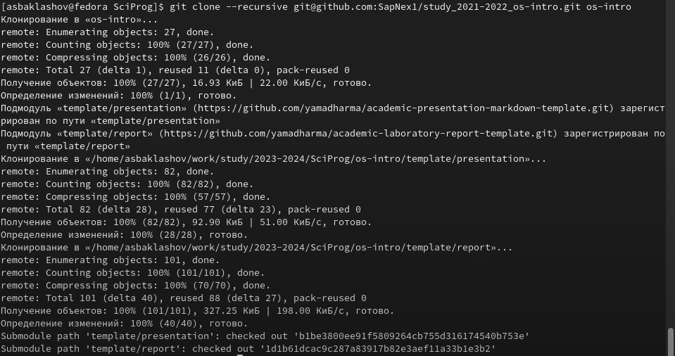{ #fig:012 width=90% }

## Шаблон для рабочего пространства

Настроим каталог курса

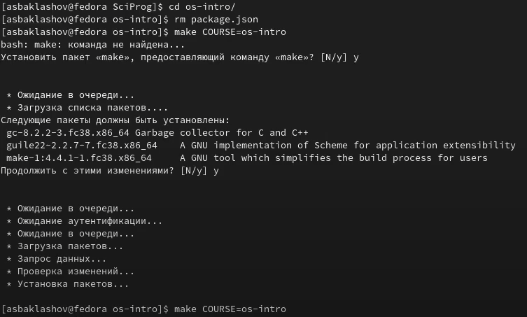{ #fig:013 width=90% }

## Шаблон для рабочего пространства

Отправим файлы на сервер

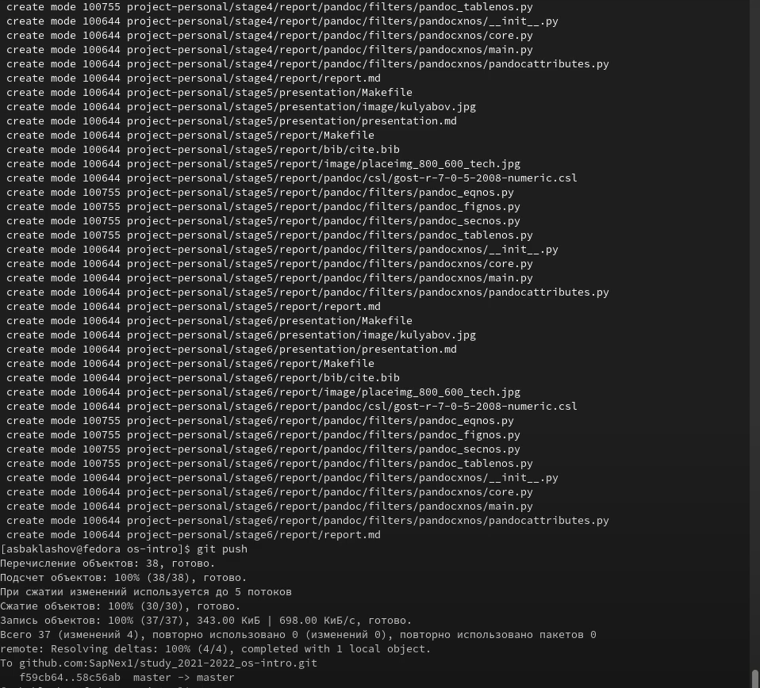{ #fig:014 width=70% }

# Выводы

В ходе данной лабораторной работы я изучил идеологию и применение средств контроля версий, а также освоил умения по работе с git.