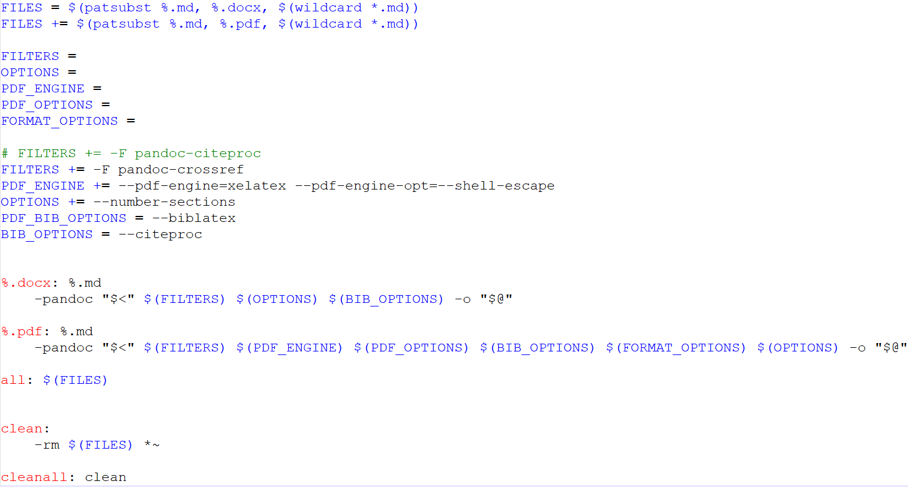
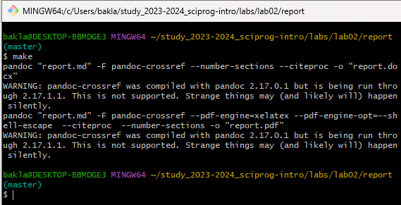
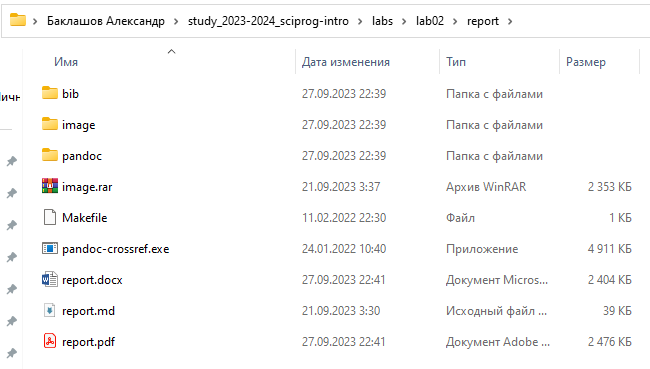
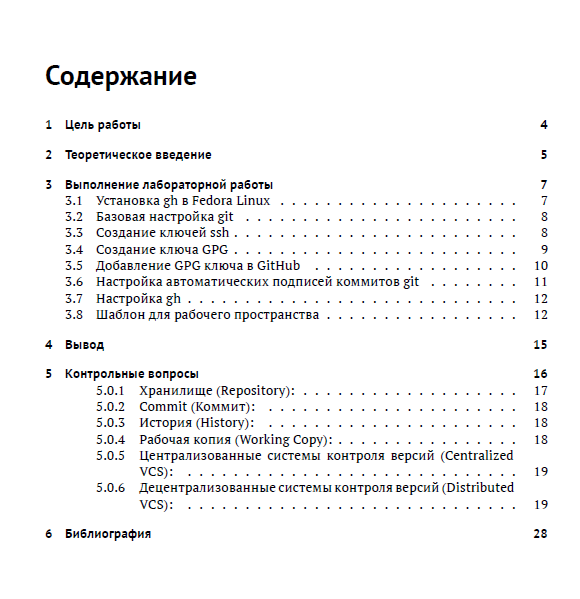

---
## Front matter
lang: ru-RU
title: Лабораторная работа №2. Markdown.
author: |
	Alexander S. Baklashov
institute: |
	RUDN University, Moscow, Russian Federation

date: 27 September, 2023

## Formatting
toc: false
slide_level: 2
theme: metropolis
header-includes: 
 - \metroset{progressbar=frametitle,sectionpage=progressbar,numbering=fraction}
 - '\makeatletter'
 - '\beamer@ignorenonframefalse'
 - '\makeatother'
aspectratio: 43
section-titles: true
---

# Цель работы

– Научиться оформлять отчёты с помощью легковесного языка разметки Markdown.

# Выполнение лабораторной работы

## Makefile

Создадим Makefile для получения отчёта в формате docx и pdf

{ #fig:001 width=85% }

## Make

В папке с отчётом напишем команду make для запуска Makefile

{ #fig:002 width=90% }

## Отчёт в двух форматах

Зафиксируем появление отчёта в формате docx и pdf

{ #fig:003 width=90% }

## Отчёт

Проверим отчет в формате pdf

{ #fig:004 width=60% } 

# Выводы

В ходе данной лабораторной работы я научился оформлять отчёты с помощью легковесного языка разметки Markdown.