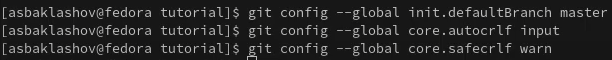
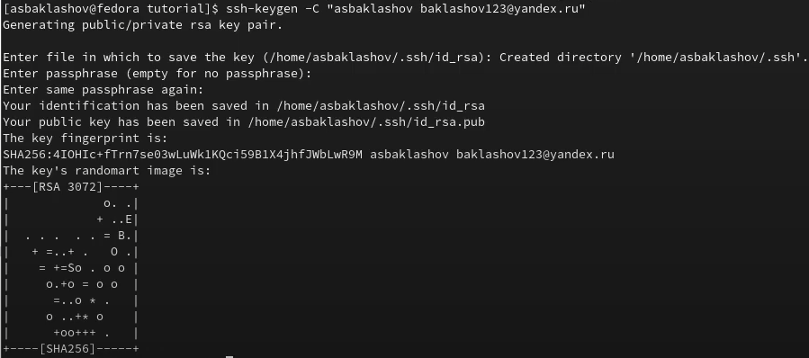
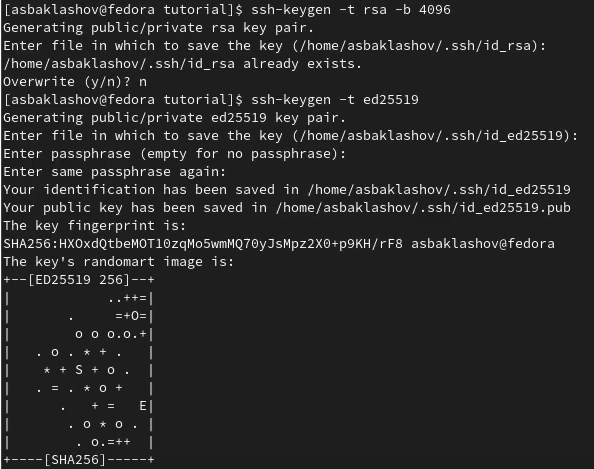
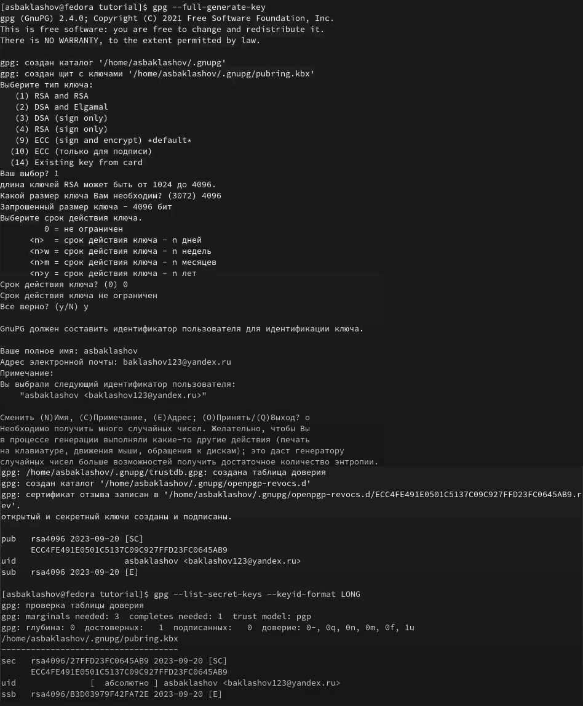
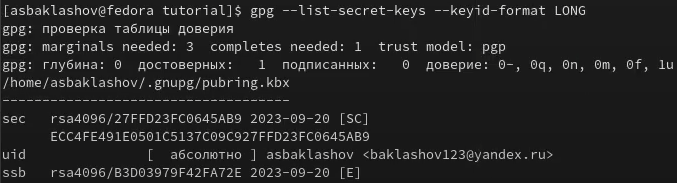
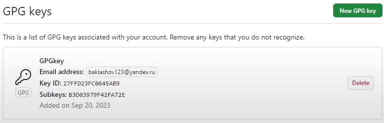
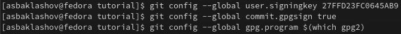
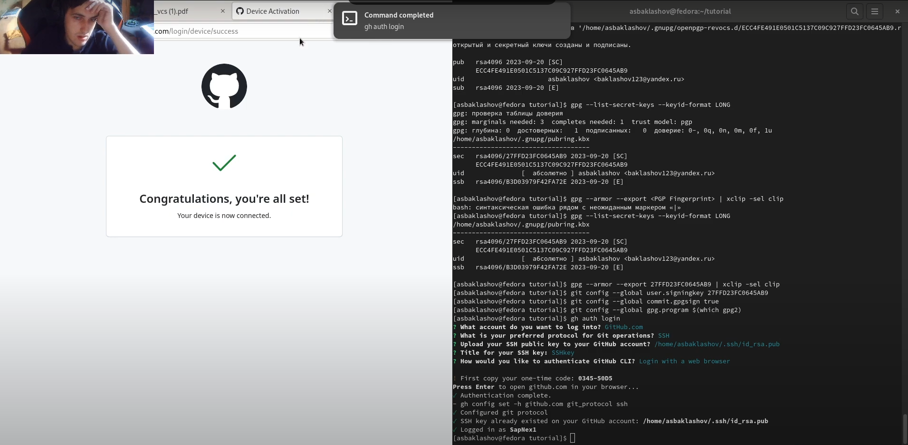
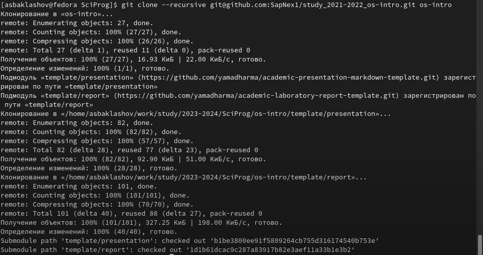
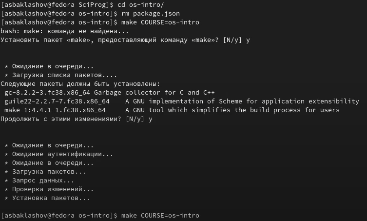

---
# Front matter
title: "Отчёт по лабораторной работе №1. Управление версиями."
subtitle: "Предмет: научное программирование"
author: "Александр Сергеевич Баклашов"

# Generic otions
lang: ru-RU
toc-title: "Содержание"

# Bibliography
bibliography: bib/cite.bib
csl: pandoc/csl/gost-r-7-0-5-2008-numeric.csl

# References settings
linkReferences: true
nameInLink: true

# Pdf output format
toc: true # Table of contents
toc_depth: 2
lof: true # List of figures
lot: false # List of tables
fontsize: 12pt
linestretch: 1.5
papersize: a4
documentclass: scrreprt
## I18n
polyglossia-lang:
  name: russian
  options:
	- spelling=modern
	- babelshorthands=true
polyglossia-otherlangs:
  name: english
### Fonts
mainfont: PT Serif
romanfont: PT Serif
sansfont: PT Sans
monofont: PT Mono
mainfontoptions: Ligatures=TeX
romanfontoptions: Ligatures=TeX
sansfontoptions: Ligatures=TeX,Scale=MatchLowercase
monofontoptions: Scale=MatchLowercase,Scale=0.9
## Biblatex
biblatex: true
biblio-style: "gost-numeric"
biblatexoptions:
  - parentracker=true
  - backend=biber
  - hyperref=auto
  - language=auto
  - autolang=other*
  - citestyle=gost-numeric
## Misc options
indent: true
header-includes:
  - \linepenalty=10 # the penalty added to the badness of each line within a paragraph (no associated penalty node) Increasing the value makes tex try to have fewer lines in the paragraph.
  - \interlinepenalty=0 # value of the penalty (node) added after each line of a paragraph.
  - \hyphenpenalty=50 # the penalty for line breaking at an automatically inserted hyphen
  - \exhyphenpenalty=50 # the penalty for line breaking at an explicit hyphen
  - \binoppenalty=700 # the penalty for breaking a line at a binary operator
  - \relpenalty=500 # the penalty for breaking a line at a relation
  - \clubpenalty=150 # extra penalty for breaking after first line of a paragraph
  - \widowpenalty=150 # extra penalty for breaking before last line of a paragraph
  - \displaywidowpenalty=50 # extra penalty for breaking before last line before a display math
  - \brokenpenalty=100 # extra penalty for page breaking after a hyphenated line
  - \predisplaypenalty=10000 # penalty for breaking before a display
  - \postdisplaypenalty=0 # penalty for breaking after a display
  - \floatingpenalty = 20000 # penalty for splitting an insertion (can only be split footnote in standard LaTeX)
  - \raggedbottom # or \flushbottom
  - \usepackage{float} # keep figures where there are in the text
  - \floatplacement{figure}{H} # keep figures where there are in the text
---

# Цель работы

– Изучить идеологию и применение средств контроля версий.

– Освоить умения по работе с git. [1]

# Теоретическое введение

Системы контроля версий (Version Control System, VCS) применяются при работе нескольких человек над одним проектом. Обычно основное дерево проекта хранится в локальном
или удалённом репозитории, к которому настроен доступ для участников проекта. При
внесении изменений в содержание проекта система контроля версий позволяет их
фиксировать, совмещать изменения, произведённые разными участниками проекта,
производить откат к любой более ранней версии проекта, если это требуется.
В классических системах контроля версий используется централизованная модель,
предполагающая наличие единого репозитория для хранения файлов. Выполнение большинства функций по управлению версиями осуществляется специальным сервером.
Участник проекта (пользователь) перед началом работы посредством определённых
команд получает нужную ему версию файлов. После внесения изменений, пользователь
размещает новую версию в хранилище. При этом предыдущие версии не удаляются
из центрального хранилища и к ним можно вернуться в любой момент. Сервер может
сохранять не полную версию изменённых файлов, а производить так называемую дельтакомпрессию — сохранять только изменения между последовательными версиями, что
позволяет уменьшить объём хранимых данных.
Системы контроля версий поддерживают возможность отслеживания и разрешения
конфликтов, которые могут возникнуть при работе нескольких человек над одним
файлом. Можно объединить (слить) изменения, сделанные разными участниками (автоматически или вручную), вручную выбрать нужную версию, отменить изменения вовсе
или заблокировать файлы для изменения. В зависимости от настроек блокировка не
позволяет другим пользователям получить рабочую копию или препятствует изменению
рабочей копии файла средствами файловой системы ОС, обеспечивая таким образом,
привилегированный доступ только одному пользователю, работающему с файлом.
Системы контроля версий также могут обеспечивать дополнительные, более гибкие
функциональные возможности. Например, они могут поддерживать работу с несколькими версиями одного файла, сохраняя общую историю изменений до точки ветвления
версий и собственные истории изменений каждой ветви. Кроме того, обычно доступна
информация о том, кто из участников, когда и какие изменения вносил. Обычно такого
рода информация хранится в журнале изменений, доступ к которому можно ограничить.
В отличие от классических, в распределённых системах контроля версий центральный
репозиторий не является обязательным.
Среди классических VCS наиболее известны CVS, Subversion, а среди распределённых — Git, Bazaar, Mercurial. Принципы их работы схожи, отличаются они в основном
синтаксисом используемых в работе команд. [1]

# Выполнение лабораторной работы

## Установка gh в Fedora Linux

1. Установим gh в Fedora Linux (рис. [-@fig:001])

{ #fig:001 width=80% }

## Базовая настройка git

2. Зададим имя и email владельца репозитория  (рис. [-@fig:002])

{ #fig:002 width=90% }

3. Зададим имя начальной ветки, параметр autocrlf, параметр safecrlf. (рис. [-@fig:003])

{ #fig:003 width=90% }

## Создание ключей ssh

4. Создадим ключ ssh по алгоритму rsa с ключём размером 4096 бит. (рис. [-@fig:004])

{ #fig:004 width=70% }

5. Создадим ключ ssh по алгоритму ed25519 (рис. [-@fig:005])

{ #fig:005 width=90% }

## Создание ключа GPG

6. Сгенерируем ключ с определёнными параметрами (рис. [-@fig:006])

{ #fig:006 width=90% }

## Добавление GPG ключа в GitHub

7. Выведем список ключей и копируем отпечаток приватного ключа (рис. [-@fig:007])

{ #fig:007 width=90% }

8. Cкопируем сгенерированный GPG ключ в буфер обмена (рис. [-@fig:008])

{ #fig:008 width=90% }

9. Перейдём в настройки GitHub, нажмём на кнопку New GPG key и вставим полученный ключ в поле ввода. (рис. [-@fig:009])

{ #fig:009 width=90% }

## Настройка автоматических подписей коммитов git

10. Используя введённый email, укажем Git применять его при подписи коммитов (рис. [-@fig:010])

{ #fig:010 width=90% }

## Настройка gh

11. Совершим настройку gh (рис. [-@fig:011])

{ #fig:011 width=90% }

## Шаблон для рабочего пространства

12. Создадим репозиторий курса на основе шаблона (рис. [-@fig:012])

{ #fig:012 width=90% }

13. Настроим каталог курса (рис. [-@fig:013])

{ #fig:013 width=90% }

14. Отправим файлы на сервер (рис. [-@fig:014])

{ #fig:014 width=90% }

# Вывод

В ходе данной лабораторной работы я изучил идеологию и применение средств контроля версий, а также освоил умения по работе с git.

# Контрольные вопросы

1. Что такое системы контроля версий (VCS) и для решения каких задач они предназначаются?

Системы контроля версий (Version Control Systems, VCS), также известные как системы управления версиями, представляют собой программные инструменты и методологии, которые используются для управления изменениями в коде, документах и других файловых ресурсах в течение времени. Они предназначены для следующих задач:

Отслеживание изменений: Системы контроля версий позволяют пользователям записывать изменения, внесенные в файлы, вместе с комментариями, которые описывают характер изменений. Это позволяет легко понимать, что и когда было изменено.

Совместная работа: VCS обеспечивают средства для совместной работы нескольких разработчиков над одним проектом. Они могут одновременно вносить изменения в файлы и объединять их в общий репозиторий.

История и восстановление: VCS сохраняют историю изменений, что позволяет восстанавливать предыдущие версии файлов и даже возвращаться к состоянию проекта на более ранние этапы его развития.

Ответвление и слияние (Branching and Merging): VCS позволяют создавать отдельные ветки (branches) проекта, чтобы работать над новыми функциями или исправлениями ошибок без влияния на основную версию. Позже эти ветки могут быть слияны (merged) в основную ветку.

Отслеживание авторства и ответственности: VCS фиксируют, кто и когда внес изменения в файлы, что помогает отслеживать авторство и ответственность за код.

Резервное копирование и восстановление данных: VCS предоставляют средства для создания резервных копий проекта, что обеспечивает защиту данных от потери или повреждения.

Ревизии и метки: Важными элементами VCS являются ревизии и метки. Ревизии представляют собой номера, присвоенные определенным состояниям репозитория, позволяя быстро находить нужную версию. Метки (tags) используются для пометки определенных моментов в истории, таких как релизы.

Работа с несколькими репозиториями: VCS также позволяют работать с несколькими удаленными репозиториями, что полезно для совместной разработки, открытого исходного кода и интеграции с другими инструментами и платформами.

Системы контроля версий, такие как Git, Subversion (SVN), Mercurial, и другие, широко используются в различных областях, включая разработку программного обеспечения, управление проектами, написание документации и многие другие, где важно отслеживание и управление изменениями в файловых ресурсах.

2. Объясните следующие понятия VCS и их отношения: хранилище, commit, история, рабочая копия.

### Хранилище (Repository):

Определение: Хранилище (репозиторий) в системе контроля версий (VCS) представляет собой центральное место, где хранится вся история изменений проекта и текущее состояние файлов.

Роль: Основная роль хранилища - сохранение истории изменений, отслеживание версий файлов, и предоставление возможности для совместной работы над проектом. Хранилище может быть локальным (на вашем компьютере), удаленным (на сервере), или распределенным (комбинация локального и удаленного).

### Commit (Коммит):

Определение: Коммит в VCS представляет собой акт сохранения изменений в репозитории. Это фиксирует текущее состояние файлов в проекте.

Роль: Коммиты используются для отслеживания изменений в проекте и создания точек в истории. Они содержат описание изменений и могут включать в себя измененные, добавленные или удаленные файлы.

### История (History):

Определение: История в VCS представляет собой запись всех прошлых коммитов и изменений, сделанных в проекте. Она включает в себя информацию о том, кто, когда и что изменил в проекте.

Роль: История позволяет просматривать, анализировать и возвращаться к предыдущим версиям проекта. Это полезно для отслеживания эволюции проекта, поиска ошибок и управления версиями.

### Рабочая копия (Working Copy):

Определение: Рабочая копия в VCS представляет собой локальную копию проекта, с которой вы работаете на своем компьютере. Она содержит файлы проекта в их текущем состоянии.

Роль: Рабочая копия позволяет вам вносить изменения в файлы, просматривать текущее состояние проекта и подготавливать коммиты. Она обновляется из репозитория при получении новых изменений и сохраняется в репозиторий при выполнении коммитов.

Отношения между этими понятиями следующие: Рабочая копия представляет собой вашу локальную рабочую среду, где вы вносите изменения в файлы проекта. Вы создаете коммиты (commit) для фиксации изменений в вашей рабочей копии. Эти коммиты сохраняются в репозитории (repository) и составляют историю изменений проекта. Таким образом, рабочая копия, коммиты и история взаимосвязаны и образуют основу работы с системой контроля версий.

3. Что представляют собой и чем отличаются централизованные и децентрализованные VCS? Приведите примеры VCS каждого вида.

Централизованные и децентрализованные системы контроля версий (VCS) представляют разные методологии управления версиями и совместной работой. 

Вот их основные характеристики и различия:

### Централизованные системы контроля версий (Centralized VCS):

Архитектура: В централизованных VCS существует один центральный сервер, на котором хранится вся история и версии проекта. Клиенты взаимодействуют с этим центральным сервером для доступа к файлам и истории.

Работа в изоляции: Когда разработчик хочет внести изменения, он создает копию (чаще называемую рабочей копией) из центрального репозитория, работает над изменениями и отправляет их обратно на сервер.

Примеры: Примерами централизованных систем контроля версий являются Subversion (SVN) и CVS (Concurrent Versions System).

### Децентрализованные системы контроля версий (Distributed VCS):

Архитектура: В децентрализованных VCS каждый разработчик имеет свой собственный локальный репозиторий, который содержит всю историю проекта. Эти локальные репозитории могут взаимодействовать друг с другом, обмениваясь изменениями.

Работа в изоляции: Каждый разработчик может работать над своими изменениями в локальном репозитории, фиксировать их и отправлять на удаленные репозитории, когда это необходимо. Это позволяет разработчикам работать в изоляции и независимо друг от друга.

Примеры: Примерами децентрализованных систем контроля версий являются Git и Mercurial.

Различия:

Архитектура: Основное различие заключается в архитектуре. В централизованных системах существует один центральный сервер, а в децентрализованных - множество локальных репозиториев.

Работа в изоляции: Децентрализованные системы позволяют разработчикам работать над изменениями в изоляции, не завися от доступности центрального сервера, что делает их более гибкими.

Отсутствие единой точки отказа: В децентрализованных системах отсутствует единая точка отказа, так как каждый разработчик имеет полную копию истории проекта.

Скорость и эффективность: Децентрализованные системы, как Git, часто считаются более быстрыми и эффективными при обмене данными и работе с историей проекта.

Примеры децентрализованных систем контроля версий включают Git и Mercurial, а примеры централизованных систем контроля версий включают Subversion (SVN) и CVS. Каждая из них имеет свои преимущества и недостатки, и выбор зависит от конкретных потребностей проекта и команды разработчиков.

4. Опишите действия с VCS при единоличной работе с хранилищем.

Если вы работаете с системой контроля версий (VCS) в одиночку, то процесс работы будет более простым и менее зависящим от взаимодействия с другими разработчиками. Вот основные действия, которые вы выполняете при единоличной работе с хранилищем VCS:

4.1. Инициализация репозитория:

Создайте новый репозиторий или склонируйте существующий, если вы начинаете работу с существующим проектом.
Создание рабочей копии (Working Copy):

После инициализации репозитория у вас появляется локальная рабочая копия, которая является вашей средой для работы над проектом.

4.2. Добавление файлов и изменений:

Добавьте файлы и директории в вашу рабочую копию, которые вы хотите отслеживать и контролировать с помощью VCS.
Вносите изменения в файлы, как обычно, с учетом вашего процесса разработки.

4.3. Фиксация изменений (Commit):

Периодически фиксируйте изменения, которые вы сделали в вашей рабочей копии, с помощью коммитов. Каждый коммит создает запись о состоянии проекта в текущий момент.
Просмотр истории и переход к предыдущим версиям:

Вы можете просматривать историю ваших коммитов и переходить к предыдущим версиям проекта, если вам это нужно.

4.4. Работа в изоляции:

Вы можете продолжать работать в изоляции, не взаимодействуя с другими разработчиками. Все ваши коммиты сохраняются локально в вашей рабочей копии.

4.5. Работа с ветками (по желанию):

Если нужно, вы можете создавать и переключаться между ветками, чтобы разрабатывать разные функции или исправлять ошибки в изоляции.

4.6. Подготовка к резервному копированию (Backup):

Поскольку ваша рабочая копия и история хранятся локально, важно регулярно создавать резервные копии репозитория для защиты от потери данных.
Отправка изменений на удаленный репозиторий (по желанию):

Если у вас есть удаленный репозиторий (например, на GitHub или GitLab), вы можете отправлять изменения на него, чтобы создать резервную копию проекта и/или совместно работать с другими разработчиками.

4.7. Соблюдение лучших практик VCS:

Вы можете использовать стандартные практики VCS, такие как хорошие комментарии к коммитам, создание веток для новых функций и т. д., даже при индивидуальной работе.

При единоличной работе с VCS, вы все равно можете получить множество преимуществ, таких как история изменений, возможность отката к предыдущим версиям, защита данных и удобное отслеживание прогресса проекта. Эти преимущества могут быть особенно полезными, если у вас есть несколько проектов или если вы хотите сотрудничать с другими разработчиками в будущем.

5. Опишите порядок работы с общим хранилищем VCS.

Порядок работы с общим хранилищем VCS включает в себя:

- Инициализацию или клонирование репозитория.
- Создание и переключение веток (по желанию).
- Внесение и изменение файлов.
- Фиксацию изменений (коммиты) с описанием.
- Получение изменений из центрального репозитория.
- Отправку изменений на сервер.
- Решение конфликтов (по необходимости).
- Соблюдение структуры и стандартов.
- Обсуждение и обратная связь (по желанию).
- Анализ истории и версий.
- Резервное копирование и безопасность.
- Завершение и управление проектом.
- Совместную работу и обмен знаниями (по желанию).

Этот порядок обеспечивает совместную разработку и управление версиями проекта в команде разработчиков.

6. Каковы основные задачи, решаемые инструментальным средством git?

Основные задачи, решаемые инструментом Git:

Управление версиями: Отслеживание изменений в файлах и создание точек в истории проекта.

Совместная разработка: Возможность совместной работы нескольких разработчиков над одним проектом.

Отслеживание изменений: Просмотр и анализ истории изменений, включая авторство и временные метки.

Управление конфликтами: Разрешение конфликтов при слиянии изменений от разных разработчиков.

Резервное копирование: Создание резервных копий и обеспечение безопасности данных проекта.

Ветвление и слияние: Создание отдельных веток для разработки новых функций и их последующее слияние в основную ветку.

Удобство и эффективность: Улучшение процесса разработки и управления проектами.

Сотрудничество и обмен знаниями: Совместная работа над проектами и обмен опытом и знаниями в команде разработчиков.

7. Назовите и дайте краткую характеристику командам git.

git init: Инициализирует новый локальный репозиторий Git в текущей директории.

git clone: Клонирует удаленный репозиторий Git на локальный компьютер.

git add: Добавляет изменения из рабочей копии в индекс для подготовки к коммиту.

git commit: Создает новый коммит, фиксируя текущее состояние проекта в истории.

git pull: Получает изменения с удаленного репозитория и автоматически сливает их с текущей веткой.

git push: Отправляет локальные изменения на удаленный репозиторий.

git branch: Показывает список веток и создает новые ветки.

git checkout: Переключает текущую ветку на другую или создает новую ветку.

git merge: Сливает изменения из одной ветки в другую.

git status: Показывает статус текущей ветки и изменения в рабочей копии.

git log: Отображает историю коммитов.

git diff: Показывает разницу между версиями файлов или коммитами.

git stash: Скрывает текущие изменения для временной работы на другой ветке.

git remote: Управляет удаленными репозиториями.

git fetch: Получает изменения из удаленного репозитория без их автоматического слияния.

git revert: Создает новый коммит, отменяющий изменения из предыдущего коммита.

git reset: Отменяет коммиты и изменения в истории репозитория.

git rm: Удаляет файлы из индекса и рабочей копии.

git tag: Управляет метками (тегами) для пометки коммитов.

git config: Устанавливает настройки Git, такие как имя пользователя и адрес электронной почты.

8. Приведите примеры использования при работе с локальным и удалённым репозиториями.

Инициализация локального репозитория:

git init

Клонирование удаленного репозитория:

git clone https://github.com/user/repo.git

Добавление и фиксация изменений:

git add file.txt

git commit -m "Добавил новый файл"

Получение изменений с удаленного репозитория:

git pull origin main

Отправка локальных изменений на удаленный репозиторий:

git push origin main

Просмотр истории коммитов:

git log

Создание и переключение веток:

git branch feature-branch
git checkout feature-branch

Слияние изменений из одной ветки в другую:

git checkout main
git merge feature-branch

Создание и переключение на новую ветку без коммита:

git checkout -b new-branch

Удаление файлов из индекса и рабочей копии:

git rm file.txt

Откат к предыдущему коммиту:

git reset --hard HEAD^

Создание и переключение на тег (метку):

git tag v1.0

9. Что такое и зачем могут быть нужны ветви (branches)?

Ветви (branches) в системе управления версиями, такой как Git, представляют собой параллельные линии разработки, которые позволяют разработчикам работать над различными функциональными частями проекта независимо друг от друга. 

Они могут быть нужны для:

Изоляции задач: Разработчики могут работать над разными задачами или функциями в отдельных ветвях, не мешая друг другу.

Параллельной разработки: Ветви позволяют одновременно разрабатывать и тестировать новые функции или исправления ошибок.

Тестирования: Ветви позволяют создавать изолированные среды для тестирования, не затрагивая основной код.

Управления версиями: Каждая ветвь может представлять новую версию проекта или стабильную ветвь для релизов.

Совместной разработки: Ветви облегчают совместную работу нескольких разработчиков над одним проектом.

Экспериментов: Ветви позволяют проводить эксперименты и не беспокоиться о влиянии на основной код.

Таким образом, ветви обеспечивают гибкость и эффективность в управлении разработкой проекта, позволяя разработчикам работать более организованно и безопасно.

10. Как и зачем можно игнорировать некоторые файлы при commit?

Вы можете игнорировать некоторые файлы при коммите в Git с помощью файла .gitignore. Этот файл содержит шаблоны для файлов и директорий, которые вы хотите исключить из контроля версий. Зачем это полезно:

Исключение временных и сгенерированных файлов: Например, вы можете игнорировать файлы, создаваемые вашей средой разработки или временные файлы, чтобы не засорять репозиторий.

Игнорирование настроек и конфиденциальных данных: Вы можете исключить файлы с настройками, содержащими пароли, ключи API и другие конфиденциальные данные, чтобы они не попали в репозиторий.

Уменьшение объема репозитория: Игнорирование больших бинарных файлов, медиафайлов или других данных, которые не должны храниться в репозитории, помогает уменьшить его размер.

Предотвращение конфликтов: Игнорирование файлов, которые могут изменяться разными способами на разных компьютерах, помогает предотвратить конфликты при слиянии.

Чтобы использовать .gitignore, создайте файл .gitignore в корневой директории вашего репозитория и добавьте в него шаблоны файлов и директорий, которые вы хотите игнорировать.

После того как .gitignore создан и настроен, Git будет игнорировать указанные файлы и директории при коммите.

# Библиография

1. Лабораторная работа №1. Управление версиями. - 12 с. [Электронный ресурс]. М. URL: [Лабораторная работа №1. Управление версиями.](https://esystem.rudn.ru/pluginfile.php/2089331/mod_resource/content/5/002-lab_vcs.pdf) (Дата обращения: 20.09.2023).