---
## Front matter
lang: ru-RU
title: Лабораторная работа №3. Введение в работу с Octave.
author: |
	Alexander S. Baklashov
institute: |
	RUDN University, Moscow, Russian Federation

date: 05 October, 2023

## Formatting
toc: false
slide_level: 2
theme: metropolis
header-includes: 
 - \metroset{progressbar=frametitle,sectionpage=progressbar,numbering=fraction}
 - '\makeatletter'
 - '\beamer@ignorenonframefalse'
 - '\makeatother'
aspectratio: 43
section-titles: true
---

# Цель работы

Изучить основы Octave

# Выполнение лабораторной работы

## Простейшие операции

Выполним простейшие операции в Octave

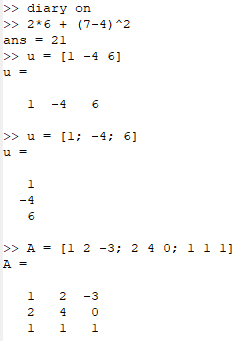{ #fig:001 width=40% }

## Операции с векторами

Выполним операции с векторами в Octave

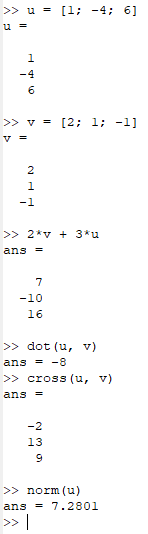{ #fig:002 width=15% }

## Вычисление проектора

Выполним вычисление проектора в Octave

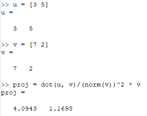{ #fig:003 width=60% }

## Матричные операции

Выполним матричные операции в Octave

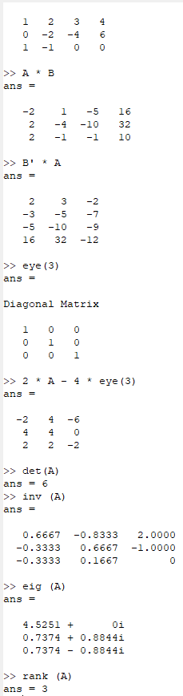{ #fig:004 width=15% }

## Построение простейших графиков

Построим график функции $sinx$ на интервале $[0, 2π]$.

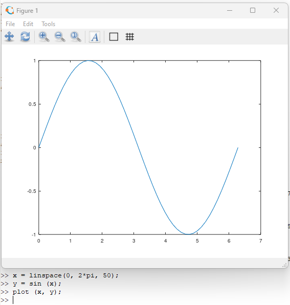{ #fig:005 width=50% }

## Улучшение графика

Улучшим построенный график

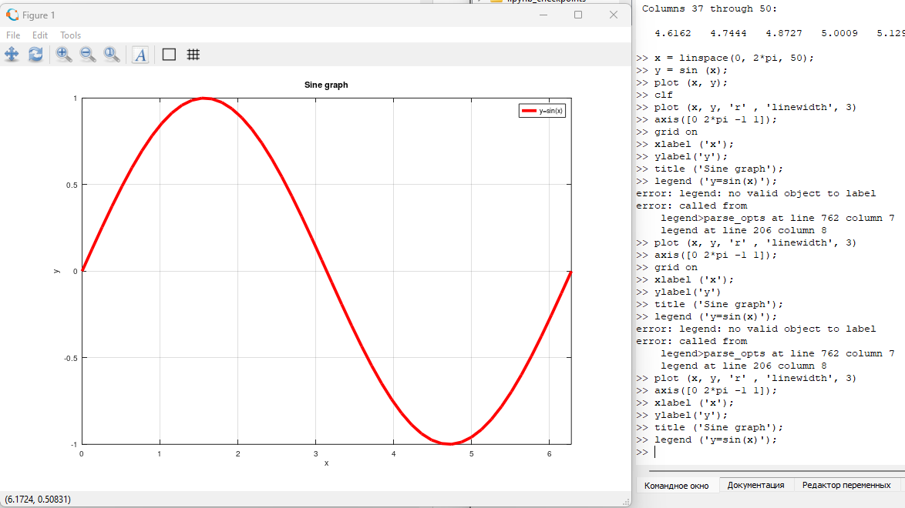{ #fig:006 width=90% }

## Два графика на одном чертеже

Нарисуем два графика на одном чертеже

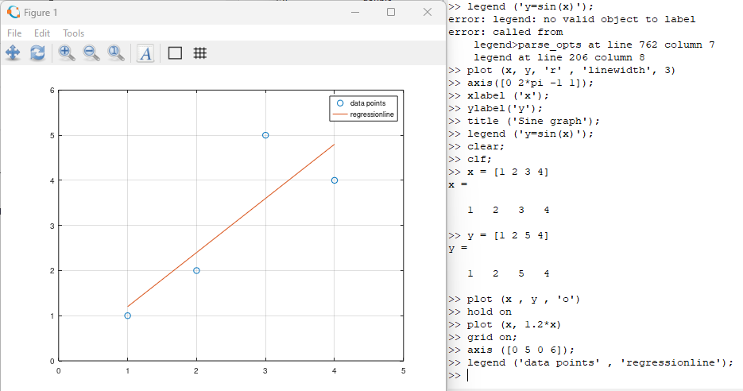{ #fig:007 width=90% }

## График $𝑦 = 𝑥^2 sinx$

Построим график $𝑦 = 𝑥^2 sinx$ 

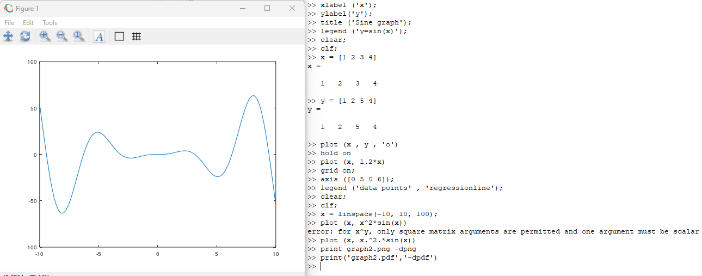{ #fig:008 width=90% }

## Сравнение циклов и операций с векторами

Вычислим сумму с помощью цикла. Создадим файл loop_for.m

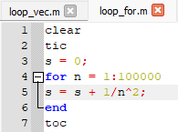{ #fig:009 width=60% }

## Сравнение циклов и операций с векторами

Вычислим сумму с помощью операций с векторами. Создадим файл loop_vec.m 

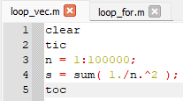{ #fig:010 width=60% }

## Сравнение циклов и операций с векторами

Запустим оба файла и сравним их производительность

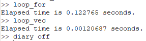{ #fig:011 width=60% }

# Вывод

В ходе данной лабораторной работы я изучил основы программной среды Octave.