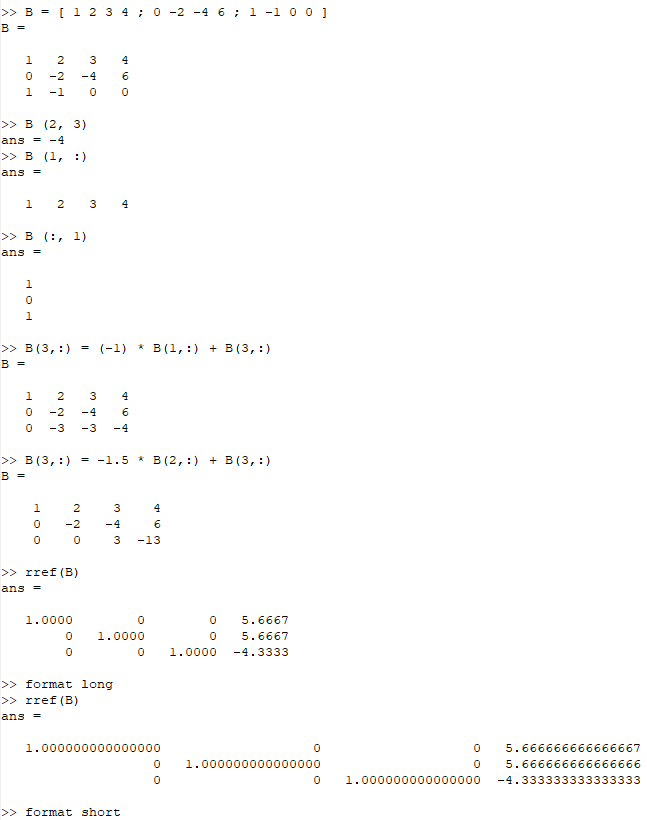
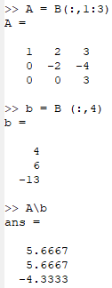
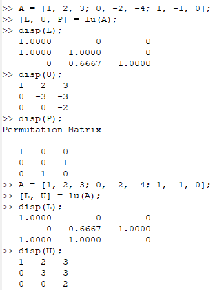

---
## Front matter
lang: ru-RU
title: Лабораторная работа №4. Системы линейных уравнений.
author: |
	Alexander S. Baklashov
institute: |
	RUDN University, Moscow, Russian Federation

date: 05 October, 2023

## Formatting
toc: false
slide_level: 2
theme: metropolis
header-includes: 
 - \metroset{progressbar=frametitle,sectionpage=progressbar,numbering=fraction}
 - '\makeatletter'
 - '\beamer@ignorenonframefalse'
 - '\makeatother'
aspectratio: 43
section-titles: true
---

# Цель работы

Изучить сложные алгоритмы, встроенные в Octave для решения систем линейных уравнений

# Выполнение лабораторной работы

## Метод Гаусса "вручную" и программно

Решим СЛУ методом Гаусса "вручную", а затем - программно

{ #fig:001 width=45% }

## Левое деление

Решим СЛУ методом левого деление в Octave

{ #fig:002 width=20% }

## LU-разложение и LUP-разложение 

Выполним LU-разложение и LUP-разложение в Octave

{ #fig:003 width=40% }

# Вывод

В ходе данной лабораторной работы я изучил сложные алгоритмы, встроенные в Octave для решения систем линейных уравнений.