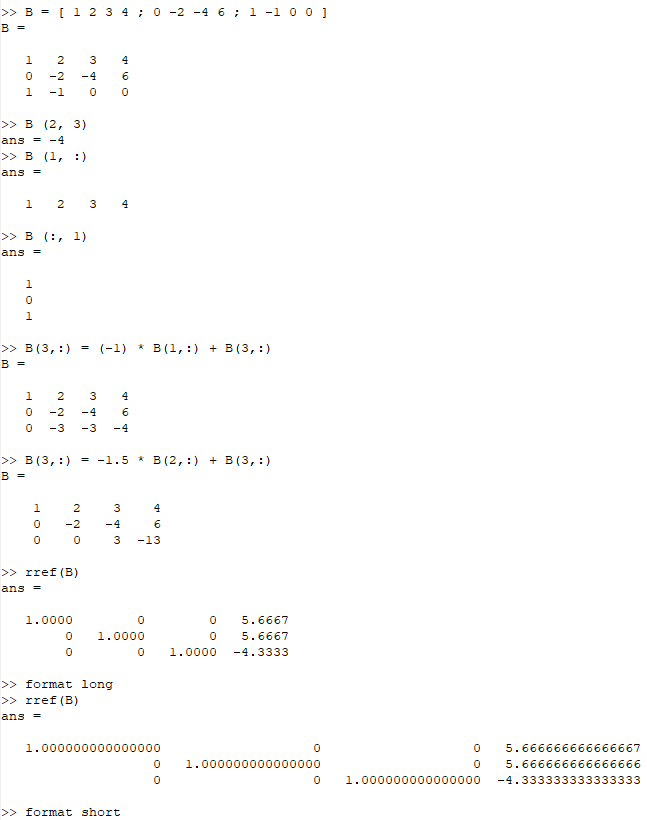
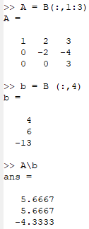
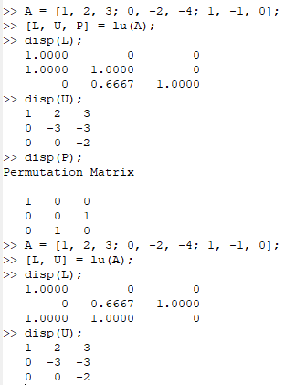

---
## Front matter
title: "Отчёт по лабораторной работе №4. Системы линейных уравнений."
subtitle: "Предмет: научное программирование"
author: "Александр Сергеевич Баклашов"

## Generic otions
lang: ru-RU
toc-title: "Содержание"

## Bibliography
bibliography: bib/cite.bib
csl: pandoc/csl/gost-r-7-0-5-2008-numeric.csl

## Pdf output format
toc: true # Table of contents
toc-depth: 2
lof: true # List of figures
lot: true # List of tables
fontsize: 12pt
linestretch: 1.5
papersize: a4
documentclass: scrreprt
## I18n polyglossia
polyglossia-lang:
  name: russian
  options:
	- spelling=modern
	- babelshorthands=true
polyglossia-otherlangs:
  name: english
## I18n babel
babel-lang: russian
babel-otherlangs: english
## Fonts
mainfont: PT Serif
romanfont: PT Serif
sansfont: PT Sans
monofont: PT Mono
mainfontoptions: Ligatures=TeX
romanfontoptions: Ligatures=TeX
sansfontoptions: Ligatures=TeX,Scale=MatchLowercase
monofontoptions: Scale=MatchLowercase,Scale=0.9
## Biblatex
biblatex: true
biblio-style: "gost-numeric"
biblatexoptions:
  - parentracker=true
  - backend=biber
  - hyperref=auto
  - language=auto
  - autolang=other*
  - citestyle=gost-numeric
## Pandoc-crossref LaTeX customization
figureTitle: "Рис."
tableTitle: "Таблица"
listingTitle: "Листинг"
lofTitle: "Список иллюстраций"
lotTitle: "Список таблиц"
lolTitle: "Листинги"
## Misc options
indent: true
header-includes:
  - \usepackage{indentfirst}
  - \usepackage{float} # keep figures where there are in the text
  - \floatplacement{figure}{H} # keep figures where there are in the text
---

# Цель работы

Изучить сложные алгоритмы, встроенные в Octave для решения систем линейных уравнений.

# Теоретическое введение

GNU Octave — свободная программная система для математических вычислений, использующая совместимый с MATLAB язык высокого уровня.

Предоставляет интерактивный командный интерфейс для решения линейных и нелинейных математических задач, а также проведения других численных экспериментов. Кроме того, Octave можно использовать для пакетной обработки. Язык Octave оперирует арифметикой вещественных и комплексных скаляров, векторов и матриц, имеет расширения для решения линейных алгебраических задач, нахождения корней систем нелинейных алгебраических уравнений, работы с полиномами, решения различных дифференциальных уравнений, интегрирования систем дифференциальных и дифференциально-алгебраических уравнений первого порядка, интегрирования функций на конечных и бесконечных интервалах. Этот список можно легко расширить, используя язык Octave (или используя динамически загружаемые модули, созданные на Си, C++, Фортране и других). [1]

# Выполнение лабораторной работы

## Метод Гаусса "вручную" и программно

1. Решим СЛУ методом Гаусса "вручную", а затем - программно (рис. [-@fig:001])

{ #fig:001 width=80% }

## Левое деление

2. Решим СЛУ методом левого деление в Octave (рис. [-@fig:002])

{ #fig:002 width=90% }

## LU-разложение и LUP-разложение 

3. Выполним LU-разложение и LUP-разложение в Octave (рис. [-@fig:003])

{ #fig:003 width=90% }

# Вывод

В ходе данной лабораторной работы я изучил сложные алгоритмы, встроенные в Octave для решения систем линейных уравнений.

# Библиография

1. Лабораторная работа №4. Системы линейных уравнений. - 6 с. [Электронный ресурс]. М. URL: [Лабораторная работа №4. Системы линейных уравнений.](https://esystem.rudn.ru/pluginfile.php/2089337/mod_resource/content/3/004-gauss.pdf) (Дата обращения: 05.10.2023).