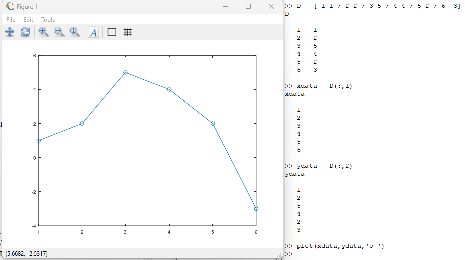
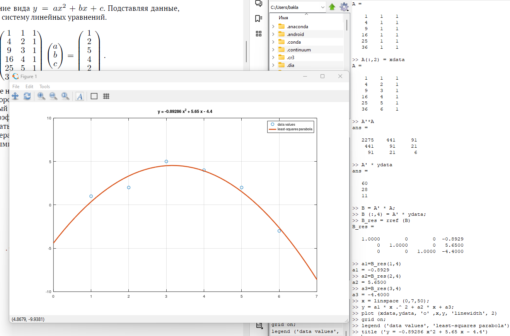
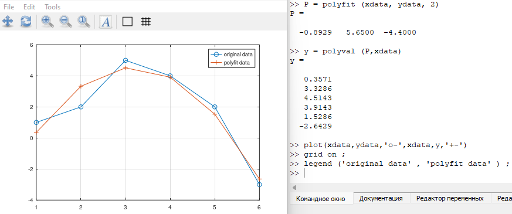
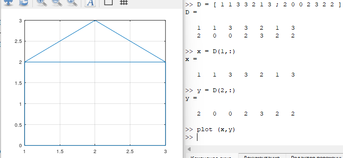
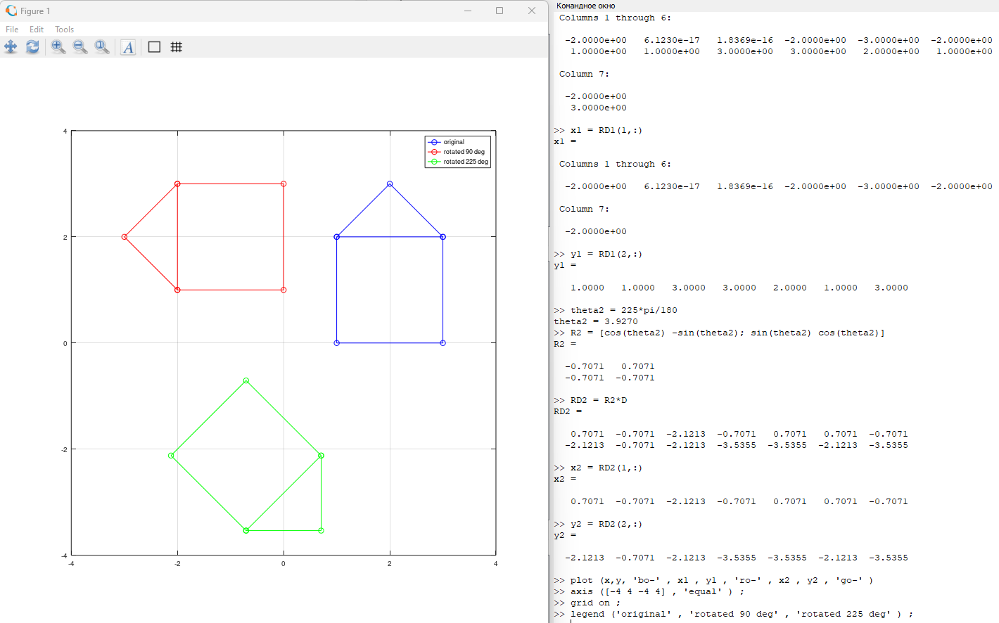
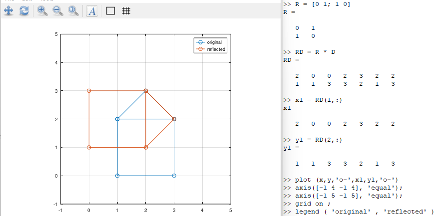
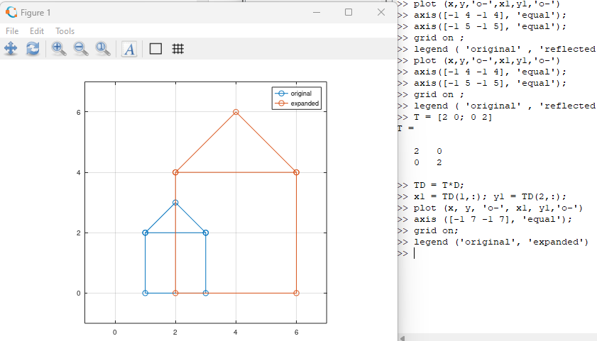

---
## Front matter
lang: ru-RU
title: Отчёт по лабораторной работе №5. Подгонка полиномиальной кривой и матричные преобразования в Octave.
author: |
	Alexander S. Baklashov
institute: |
	RUDN University, Moscow, Russian Federation

date: 05 October, 2023

## Formatting
toc: false
slide_level: 2
theme: metropolis
header-includes: 
 - \metroset{progressbar=frametitle,sectionpage=progressbar,numbering=fraction}
 - '\makeatletter'
 - '\beamer@ignorenonframefalse'
 - '\makeatother'
aspectratio: 43
section-titles: true
---

# Цель работы

Изучить способы подгонки полиномиальной кривой и некоторые матричные преобразования в Octave

# Выполнение лабораторной работы

## Подгонка полиномиальной кривой

Построим график точек, под которые будем подгонять параболу

{ #fig:001 width=100% }

## Подгонка полиномиальной кривой

Пусть нам нужно найти параболу по методу наименьших квадратов для набора точек, заданных матрицей выше

{ #fig:002 width=80% }

## Polyfit

Процесс подгонки может быть автоматизирован встроенными функциями Octave. Для этого мы можем использовать встроенную функцию для подгонки полинома polyfit.

{ #fig:003 width=90% }

## Матричные преобразования

Представим изображение домика в виде матрицы.

{ #fig:004 width=90% } 

## Вращение

Повернём граф дома на 90 и 225 градусов

{ #fig:005 width=90% }

## Отражение

Отразим граф дома относительно прямой $𝑦 = 𝑥$

{ #fig:006 width=90% }

## Дилатация

Увеличим граф дома в 2 раза

{ #fig:007 width=90% }

# Выводы

В ходе данной лабораторной работы я изучил способы подгонки полиномиальной кривой и некоторые матричные преобразования в Octave.