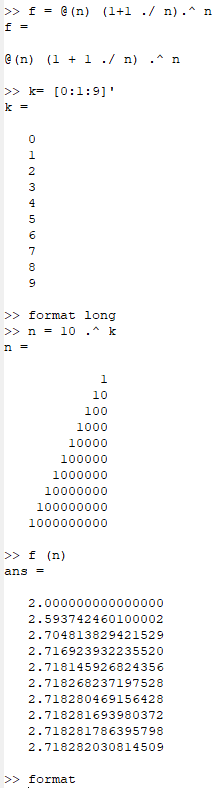
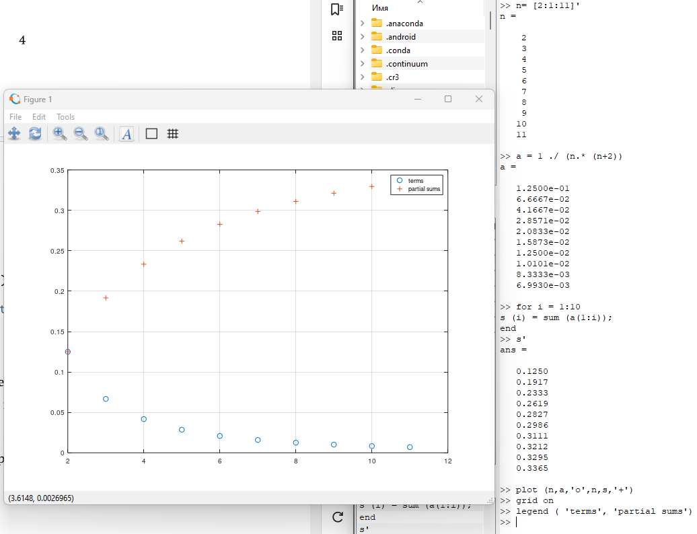
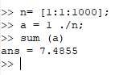
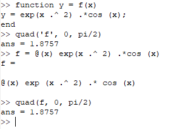
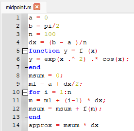
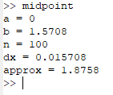
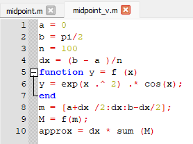
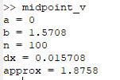
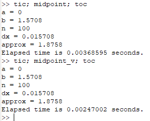

---
## Front matter
lang: ru-RU
title: Отчёт по лабораторной работе №6. Пределы, последовательности и ряды, интегралы.
author: |
	Alexander S. Baklashov
institute: |
	RUDN University, Moscow, Russian Federation

date: 22 November, 2023

## Formatting
toc: false
slide_level: 2
theme: metropolis
header-includes: 
 - \metroset{progressbar=frametitle,sectionpage=progressbar,numbering=fraction}
 - '\makeatletter'
 - '\beamer@ignorenonframefalse'
 - '\makeatother'
aspectratio: 43
section-titles: true
---

# Цель работы

Изучить пределы, последовательности и ряды и интегралы в Octave.

# Выполнение лабораторной работы

## Пределы, последовательности и ряды

Изучим пределы, последовательности и ряды

{ #fig:001 width=15% }

## Частичные суммы

Построим частичные суммы

{ #fig:002 width=80% }

## Сумма ряда

Найдём сумму первых 1000 членов гармонического ряда: $\sum^{1000}_{n=1} \frac{1}{n}$

{ #fig:003 width=60% }

# Численное интегрирование

## Вычисление интегралов

Вычислим интеграл: $\int^{\pi/2}_{0}e^{x^2}cos(x)dx$.

{ #fig:004 width=70% }

## Аппроксимирование суммами. Скрипт.

Напишем скрипт, чтобы вычислить интеграл $\int^{\pi/2}_{0}e^{x^2}cos(x)dx$ по правилу средней точки для n = 100

{ #fig:005 width=50% }

## Аппроксимирование суммами. Результаты.

{ #fig:006 width=60% }

## Аппроксимирование суммами. Векторизованный код. Скрипт.

Напишем скрипт, чтобы вычислить интеграл $\int^{\pi/2}_{0}e^{x^2}cos(x)dx$ по правилу средней точки для n = 100

{ #fig:007 width=60% }

## Аппроксимирование суммами. Векторизованный код. Результаты.

{ #fig:008 width=90% }

## Сравнение времени

{ #fig:009 width=70% }

# Выводы

В ходе данной лабораторной работы я изучил пределы, последовательности и ряды и интегралы в Octave.