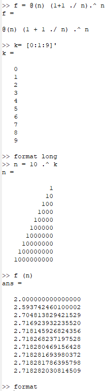
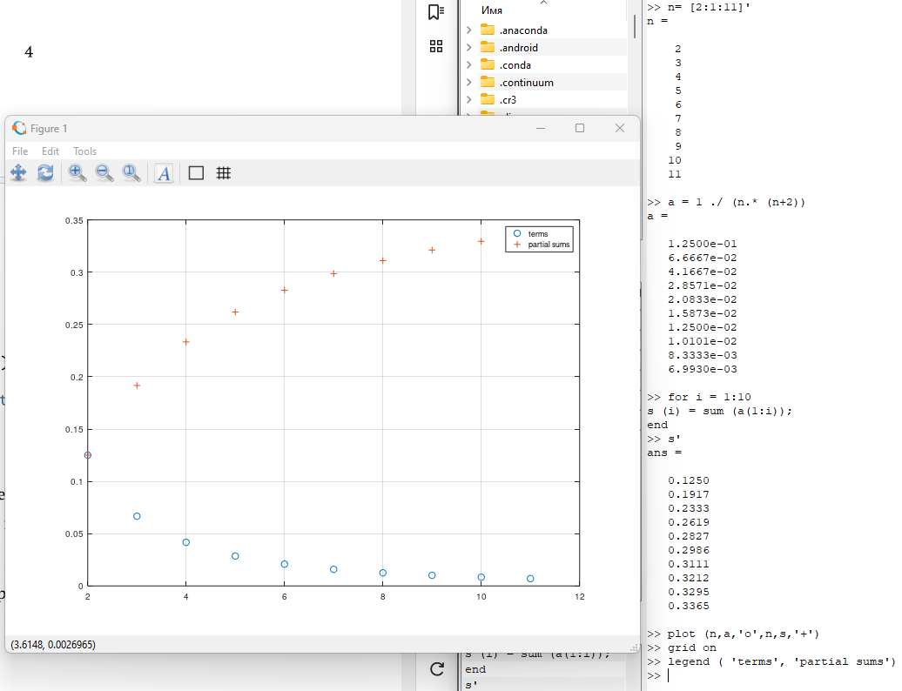
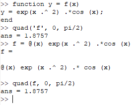
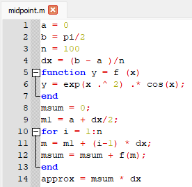
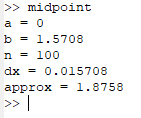
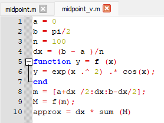
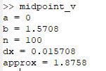
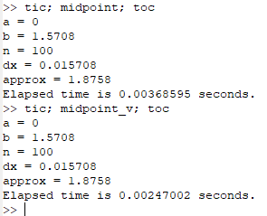

---
## Front matter
title: "Отчёт по лабораторной работе №6. Пределы, последовательности и ряды, интегралы."
subtitle: "Предмет: научное программирование"
author: "Александр Сергеевич Баклашов"

## Generic otions
lang: ru-RU
toc-title: "Содержание"

## Bibliography
bibliography: bib/cite.bib
csl: pandoc/csl/gost-r-7-0-5-2008-numeric.csl

## Pdf output format
toc: true # Table of contents
toc-depth: 2
lof: true # List of figures
lot: true # List of tables
fontsize: 12pt
linestretch: 1.5
papersize: a4
documentclass: scrreprt
## I18n polyglossia
polyglossia-lang:
  name: russian
  options:
	- spelling=modern
	- babelshorthands=true
polyglossia-otherlangs:
  name: english
## I18n babel
babel-lang: russian
babel-otherlangs: english
## Fonts
mainfont: PT Serif
romanfont: PT Serif
sansfont: PT Sans
monofont: PT Mono
mainfontoptions: Ligatures=TeX
romanfontoptions: Ligatures=TeX
sansfontoptions: Ligatures=TeX,Scale=MatchLowercase
monofontoptions: Scale=MatchLowercase,Scale=0.9
## Biblatex
biblatex: true
biblio-style: "gost-numeric"
biblatexoptions:
  - parentracker=true
  - backend=biber
  - hyperref=auto
  - language=auto
  - autolang=other*
  - citestyle=gost-numeric
## Pandoc-crossref LaTeX customization
figureTitle: "Рис."
tableTitle: "Таблица"
listingTitle: "Листинг"
lofTitle: "Список иллюстраций"
lotTitle: "Список таблиц"
lolTitle: "Листинги"
## Misc options
indent: true
header-includes:
  - \usepackage{indentfirst}
  - \usepackage{float} # keep figures where there are in the text
  - \floatplacement{figure}{H} # keep figures where there are in the text
---

# Цель работы

Изучить пределы, последовательности и ряды и интегралы в Octave.

# Теоретическое введение

GNU Octave — свободная программная система для математических вычислений, использующая совместимый с MATLAB язык высокого уровня.

Предоставляет интерактивный командный интерфейс для решения линейных и нелинейных математических задач, а также проведения других численных экспериментов. Кроме того, Octave можно использовать для пакетной обработки. Язык Octave оперирует арифметикой вещественных и комплексных скаляров, векторов и матриц, имеет расширения для решения линейных алгебраических задач, нахождения корней систем нелинейных алгебраических уравнений, работы с полиномами, решения различных дифференциальных уравнений, интегрирования систем дифференциальных и дифференциально-алгебраических уравнений первого порядка, интегрирования функций на конечных и бесконечных интервалах. Этот список можно легко расширить, используя язык Octave (или используя динамически загружаемые модули, созданные на Си, C++, Фортране и других). [1]

# Выполнение лабораторной работы

## Пределы, последовательности и ряды

Octave - полноценный язык программирования, поддерживающий
множество типов циклов и условных операторов. Однако, поскольку
это векторный язык, многие вещи, которые можно было бы сделать
с помощью циклов, можно векторизовать. Под векторизованным кодом
мы понимаем следующее: вместо того, чтобы писать цикл для
многократной оценки функции, мы сгенерируем вектор входных значений,
а затем оценим функцию с использованием векторного ввода.
В результате получается код, который легче читать и понимать, и он
выполняется быстрее благодаря эффективным алгоритмам для матричных
операций.

Рассмотрим предел:

$lim_{n\rightarrow \infty} = \left(1+\frac{1}{n}\right)^n$

Оценим это выражение.
Нужно определить функцию. Есть несколько способов сделать это.
Метод, который мы здесь используем, называется анонимной функцией.
Это хороший способ быстро определить простую функцию.

1. Определим анонимную функцию (Обратите внимание на использование поэлементных операций.
Мы назвали функцию f. Входная переменная обозначается знаком @, за которым следует переменная в скобках. Следующее выражение будет использоваться при оценке функции. Теперь f можно использовать как любую функцию в Octave.) 

2. Далее мы создаём индексную переменную, состоящую из целых чисел от 0 до 9 

3. Синтаксис [0:1:9] создает вектор строки, который начинается
с 0 и увеличивается с шагом от 1 до 9. Обратите внимание, что мы
использовали операцию транспонирования просто потому, что наши
результаты будут легче читать как векторы-столбцы. Теперь мы возьмём
степени 10, которые будут входными значениями, а затем оценим f (n).

Все пункты показаны на рисунке (рис. [-@fig:001])

{ #fig:001 width=80% }

Предел сходится к конечному значению, которое составляет приблизительно
2,71828... Подобные методы могут быть использованы
для численного исследования последовательностей и рядов.

### Частичные суммы

1. Пусть $a\sum^{\infty}_{n=2}a_n -$ ряд, n-й член равен $$a_n=\frac{1}{n(n+2)}$$. Для этого мы определим индексный вектор п от 2 до 11, а затем
вычислим члены.

2. Если мы хотим знать частичную сумму, нам нужно только написать
sum (а) . Если мы хотим получить последовательность частичных сумм,
нам нужно использовать цикл. Мы будем использовать цикл for с
индексом i от 1 до 10. Для каждого i мы получим частичную сумму
последовательности $a_n$ от первого слагаемого до $i$-го слагаемого. На
выходе получается 10-элементный вектор этих частичных сумм. 

3. Наконец, мы построим слагаемые и частичные суммы для $2 \leq n \leq 11$.

Все пункты показаны на рисунке(рис. [-@fig:002])

{ #fig:002 width=90% }

### Сумма ряда

1. Найдём сумму первых 1000 членов гармонического ряда: $$\sum^{1000}_{n=1} \frac{1}{n}$$ Нам нужно только сгенерировать члены как ряда вектор, а затем взять их сумму. (рис. [-@fig:003])

{ #fig:003 width=90% }

## Численное интегрирование

### Вычисление интегралов

Octave имеет несколько встроенных функций для вычисления определённых
интегралов. Мы будем использовать команду quad (сокращение
от слова квадратура).

1. Вычислим интеграл: $$\int^{\pi/2}_{0}e^{x^2}cos(x)dx$$ Синтаксис команды - quad('f', а, b). Нам нужно сначала определить функцию.

Обратите внимание, что функция ехр(х) используется для $e^x$. Мы использовали конструкцию function ... end Мы могли бы также использовать анонимную функцию (сделайте это). Обратите внимание,
что кавычки вокруг имени f не используются, если используется
анонимная функция. (рис. [-@fig:004])

{ #fig:004 width=70% }

### Аппроксимирование суммами

1. Правило средней точки, правило трапеции и правило Симпсона являются
общими алгоритмами, используемыми для численного интегрирования.
Напишем скрипт, чтобы вычислить интеграл $$\int^{\pi/2}_{0}e^{x^2}cos(x)dx$$ по правилу средней точки для n = 100.

Стратегия заключается в использовании цикла, который добавляет
значение функции к промежуточной сумме с каждой итерацией. В
конце сумма умножается на $\Delta x$.

Введём код в текстовом файле и назовём его midpoint.m. (рис. [-@fig:005])

{ #fig:005 width=90% }

Он должен быть помещён в ваш рабочий каталог, а затем его можно
запустить, набрав midpoint в командной строке. (рис. [-@fig:006])

{ #fig:006 width=90% }

2. Традиционный код работает хорошо, но поскольку Octave является
векторным языком, также можно писать векторизованный код,
который не требует каких-либо циклов.
Создадим вектор x-координат средних точек. Затем мы оцениваем
f по этому вектору средней точки, чтобы получить вектор значений
функции. Аппроксимация средней точки - это сумма компонент вектора,
умноженная на $\Delta x$. (рис. [-@fig:007])

{ #fig:007 width=90% }

Запустим его. (рис. [-@fig:008])

{ #fig:008 width=90% }

3. Сравним время выполнения для каждой реализации.(рис. [-@fig:009])

{ #fig:009 width=90% }

# Вывод

В ходе данной лабораторной работы я изучил пределы, последовательности и ряды и интегралы в Octave.

# Библиография

1. Лабораторная работа №6. - 10 с. [Электронный ресурс]. М. URL: [Лабораторная работа №6.](https://esystem.rudn.ru/pluginfile.php/2089341/mod_resource/content/2/README.pdf) (Дата обращения: 22.11.2023).