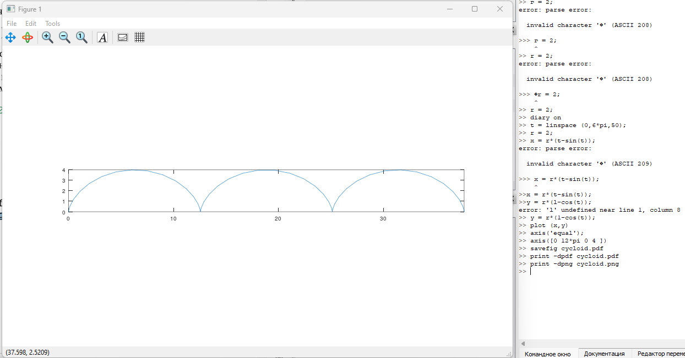
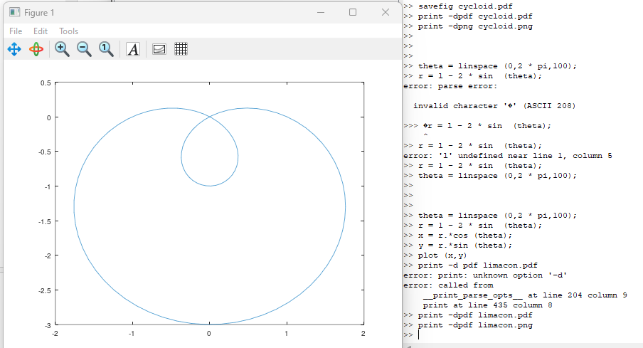
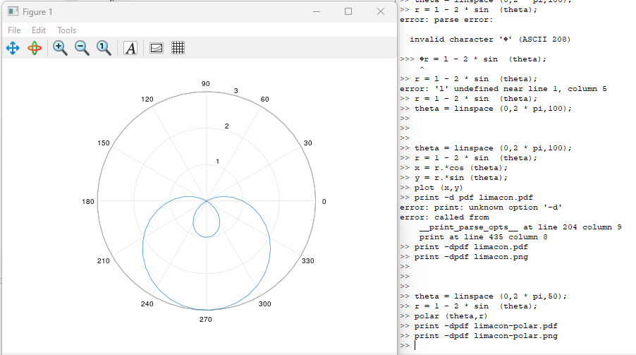
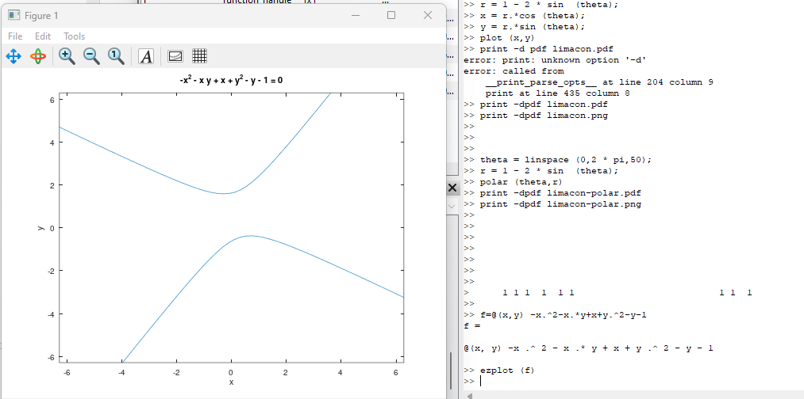
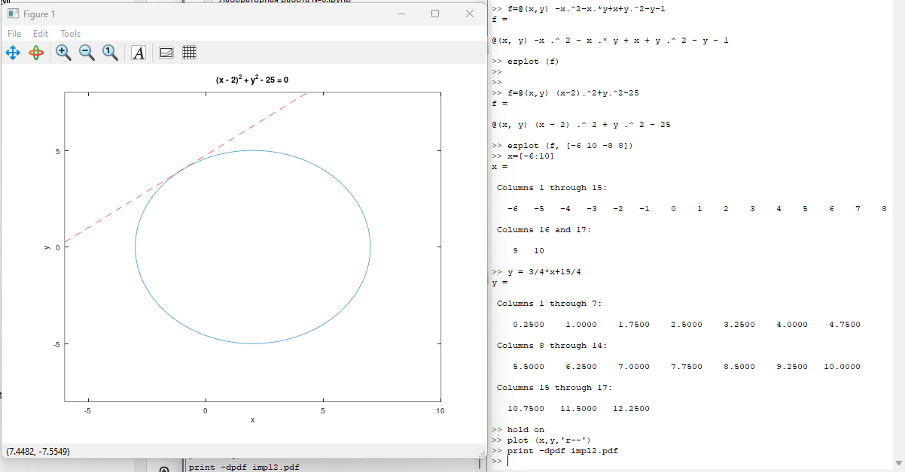
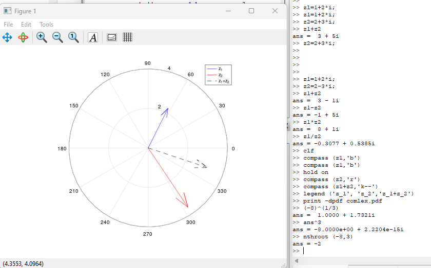
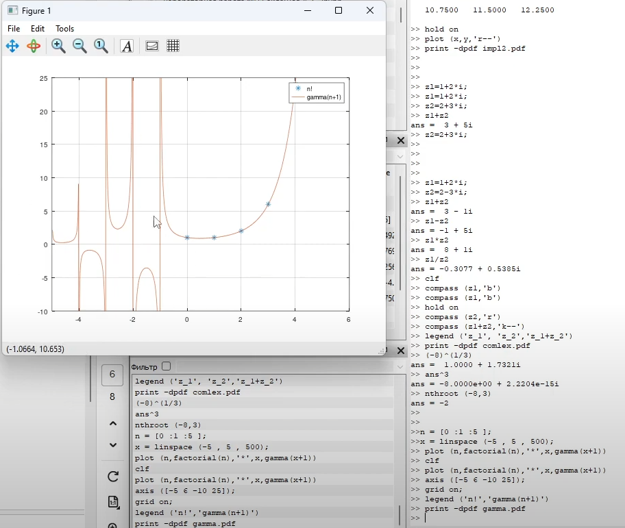
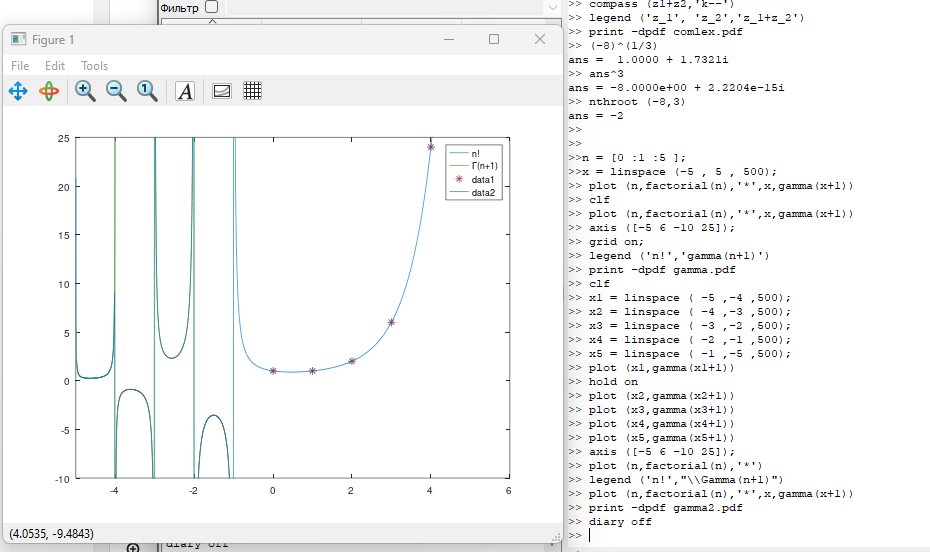

---
## Front matter
lang: ru-RU
title: Отчёт по лабораторной работе №7. Графики.
author: |
	Alexander S. Baklashov
institute: |
	RUDN University, Moscow, Russian Federation

date: 05 December, 2023

## Formatting
toc: false
slide_level: 2
theme: metropolis
header-includes: 
 - \metroset{progressbar=frametitle,sectionpage=progressbar,numbering=fraction}
 - '\makeatletter'
 - '\beamer@ignorenonframefalse'
 - '\makeatother'
aspectratio: 43
section-titles: true
---

# Цель работы

Изучить графики в Octave.

# Выполнение лабораторной работы

## Параметрические графики

Параметрические уравнения для циклоиды:
$x = r (t — sin(t)), y = r ( 1 — cos(t))$.

Построим график трёх периодов циклоиды радиуса 2.

{ #fig:001 width=80% }

## Полярные координаты

Построим улитку Паскаля

{ #fig:002 width=90% }

## Улитка Паскаля в полярных осях

Также можно построить функцию
$$r=f(\nu)$$

в полярных осях, используя команду polar.

{ #fig:003 width=70% }

## Графики неявных функций

Построим кривую, определяемую уравнением
$-x^2 - xy + x + y^2 - y = 1$

{ #fig:004 width=100% }

## Графики неявных функций

Найдём уравнение касательной к графику окружности
$$(x - 2)^2 + y^2 = 25$$
в точке $(-1,4)$. Построим график окружности и касательной.

{ #fig:005 width=80% }

## Комплексные числа

Пусть $z_1 = 1 + 2i, z_2 = 2 — 3i$. Построим графики $z_1, z_2$ и $z_1 + z_2$
в комплексной плоскости. 

{ #fig:006 width=80% }

## Специальные функции

Построим функции $\Gamma(x+1)$ и $n!$ на одном графике. 

{ #fig:007 width=70% }

## Специальные функции

Устраним артефакты вычисления.

{ #fig:008 width=90% }

# Выводы

В ходе данной лабораторной работы я изучил графики в Octave.