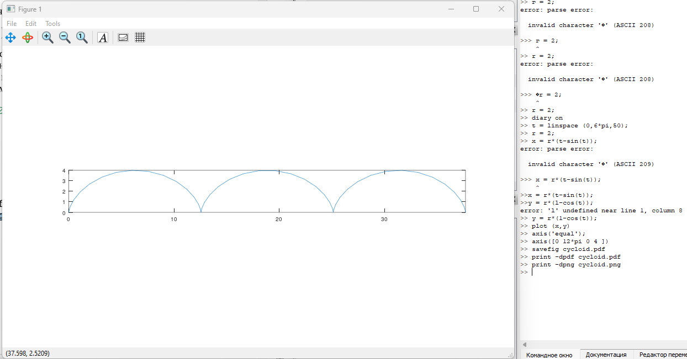
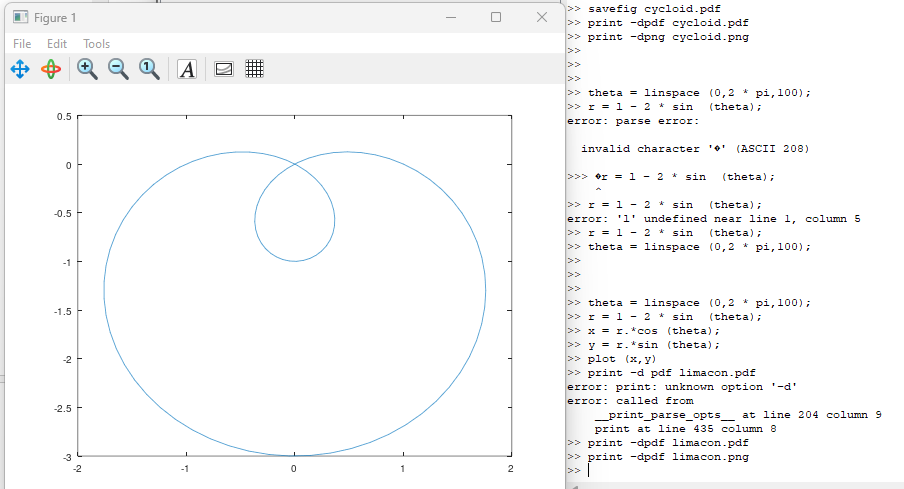
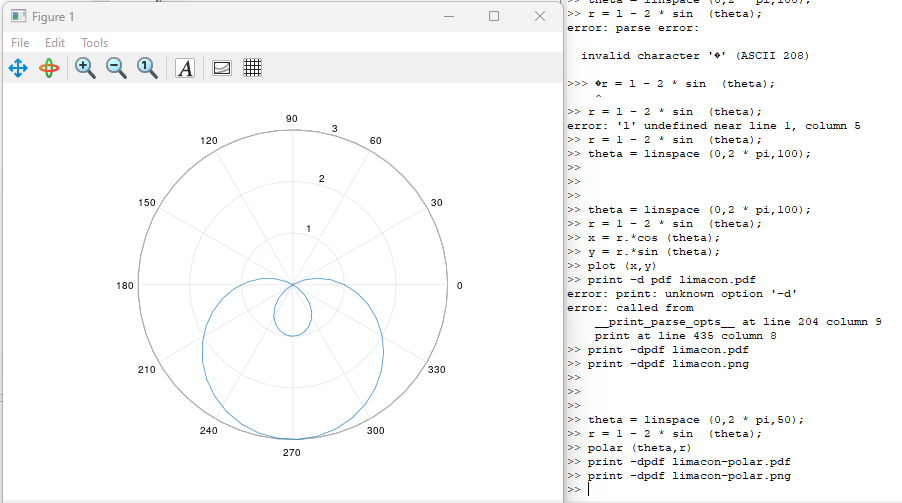
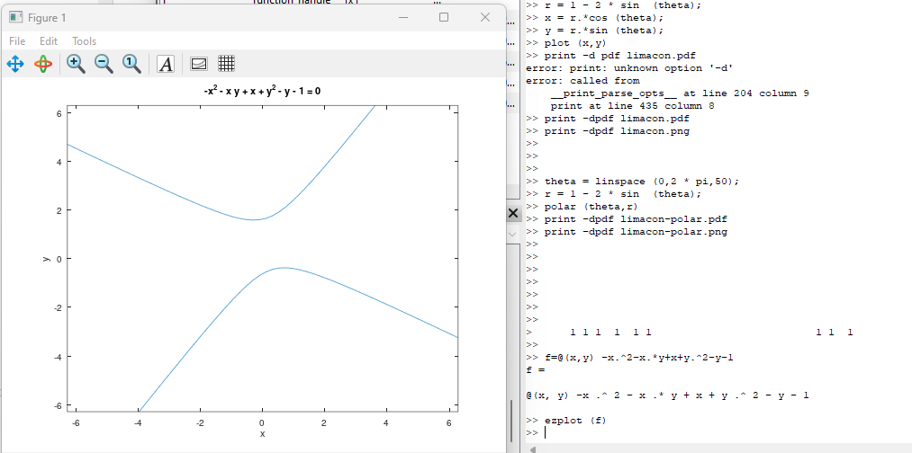
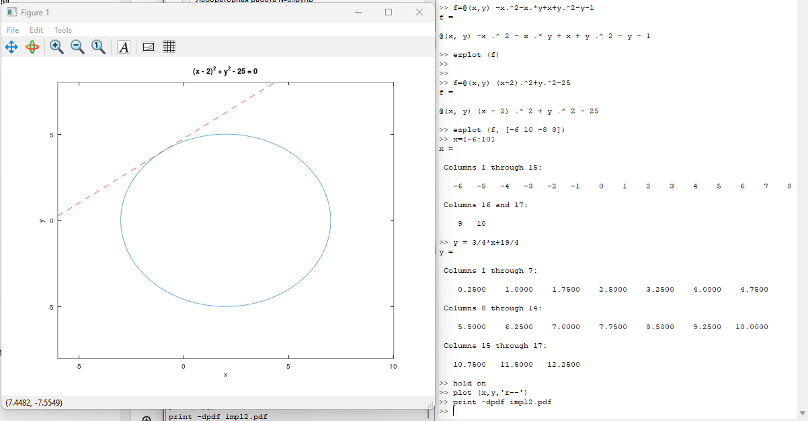
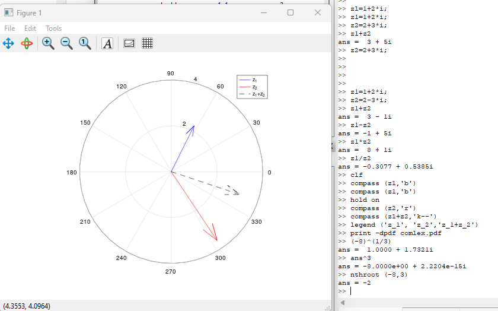
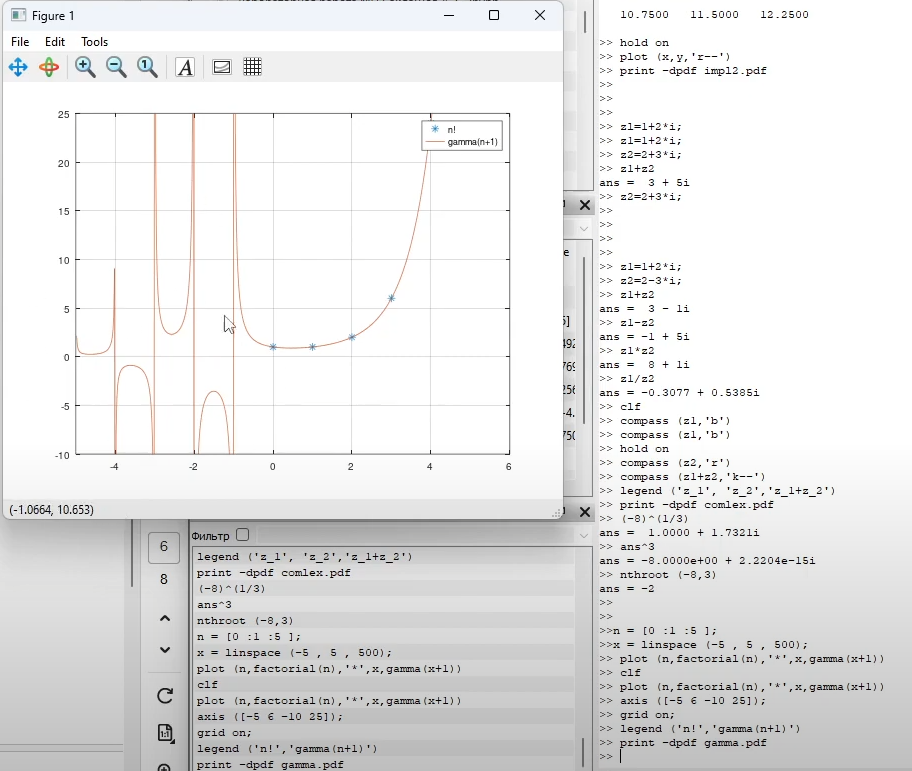
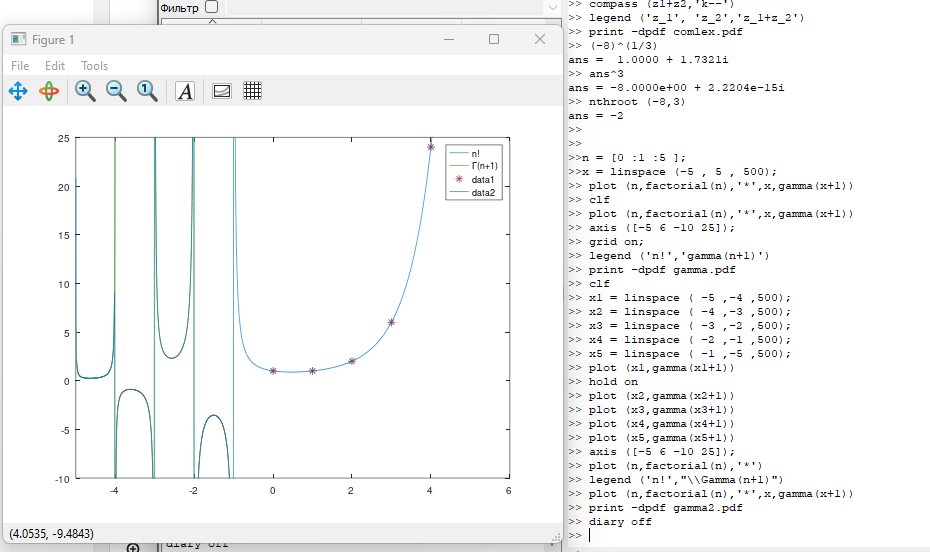

---
## Front matter
title: "Отчёт по лабораторной работе №7. Графики."
subtitle: "Предмет: научное программирование"
author: "Александр Сергеевич Баклашов"

## Generic otions
lang: ru-RU
toc-title: "Содержание"

## Bibliography
bibliography: bib/cite.bib
csl: pandoc/csl/gost-r-7-0-5-2008-numeric.csl

## Pdf output format
toc: true # Table of contents
toc-depth: 2
lof: true # List of figures
lot: true # List of tables
fontsize: 12pt
linestretch: 1.5
papersize: a4
documentclass: scrreprt
## I18n polyglossia
polyglossia-lang:
  name: russian
  options:
	- spelling=modern
	- babelshorthands=true
polyglossia-otherlangs:
  name: english
## I18n babel
babel-lang: russian
babel-otherlangs: english
## Fonts
mainfont: PT Serif
romanfont: PT Serif
sansfont: PT Sans
monofont: PT Mono
mainfontoptions: Ligatures=TeX
romanfontoptions: Ligatures=TeX
sansfontoptions: Ligatures=TeX,Scale=MatchLowercase
monofontoptions: Scale=MatchLowercase,Scale=0.9
## Biblatex
biblatex: true
biblio-style: "gost-numeric"
biblatexoptions:
  - parentracker=true
  - backend=biber
  - hyperref=auto
  - language=auto
  - autolang=other*
  - citestyle=gost-numeric
## Pandoc-crossref LaTeX customization
figureTitle: "Рис."
tableTitle: "Таблица"
listingTitle: "Листинг"
lofTitle: "Список иллюстраций"
lotTitle: "Список таблиц"
lolTitle: "Листинги"
## Misc options
indent: true
header-includes:
  - \usepackage{indentfirst}
  - \usepackage{float} # keep figures where there are in the text
  - \floatplacement{figure}{H} # keep figures where there are in the text
---

# Цель работы

Изучить графики в Octave.

# Теоретическое введение

GNU Octave — свободная программная система для математических вычислений, использующая совместимый с MATLAB язык высокого уровня.

Предоставляет интерактивный командный интерфейс для решения линейных и нелинейных математических задач, а также проведения других численных экспериментов. Кроме того, Octave можно использовать для пакетной обработки. Язык Octave оперирует арифметикой вещественных и комплексных скаляров, векторов и матриц, имеет расширения для решения линейных алгебраических задач, нахождения корней систем нелинейных алгебраических уравнений, работы с полиномами, решения различных дифференциальных уравнений, интегрирования систем дифференциальных и дифференциально-алгебраических уравнений первого порядка, интегрирования функций на конечных и бесконечных интервалах. Этот список можно легко расширить, используя язык Octave (или используя динамически загружаемые модули, созданные на Си, C++, Фортране и других). [1]

# Выполнение лабораторной работы

## Параметрические графики

Параметрические уравнения для циклоиды:
$$x = r (t — sin(t)), y = r ( 1 — cos(t))$$.

Построим график трёх периодов циклоиды радиуса 2. Решение.
Поскольку период $2\pi$, нам нужно, чтобы параметр был в пределах
$0 < t < 6\pi$ для трёх полных циклов. Определим параметр $t$ как
вектор в этом диапазоне, затем мы вычислим $x$ и $y$. (рис. [-@fig:001])

{ #fig:001 width=80% }

## Полярные координаты

Графики в полярных координатах строятся аналогичным образом. Для
функции $r=f(\nu)$
мы начинаем с определения независимой переменной $\nu$, затем вычисляем
$r$. Чтобы построить график, мы вычислим $x$ и $y$, используем
стандартное преобразование координат
$$x = rcos(\nu),y = rsin (\nu)$$
затем построим график в осях $x$ $y$.
Построим улитку Паскаля
$r = 1 - 2 sin(\nu)$.(рис. [-@fig:002])

{ #fig:002 width=90% }

Также можно построить функцию
$$r=f(\nu)$$

в полярных осях, используя команду polar. (рис. [-@fig:003])

{ #fig:003 width=90% }

## Графики неявных функций

Построим кривую, определяемую уравнением
$-x^2 - xy + x + y^2 - y = 1$ (рис. [-@fig:004])

{ #fig:004 width=70% }

Найдём уравнение касательной к графику окружности
$$(x - 2)^2 + y^2 = 25$$
в точке $(-1,4)$. Построим график окружности и касательной. (рис. [-@fig:005])

{ #fig:005 width=90% }

## Комплексные числа

Пусть $z_1 = 1 + 2i, z_2 = 2 — 3i$. Запишем основные арифметические
операции с этими числами. Мы можем построить график в комплексной плоскости, используя
команду compass.

Пусть $z_1 = 1 + 2i, z_2 = 2 — 3i$. Построим графики $z_1, z_2$ и $z_1 + z_2$
в комплексной плоскости. 

Иногда Octave может неожиданно выдать странные результаты для
комплексных чисел $-8^{1/3}$.

Ожидался ответ -2, мы также можем легко проверить, что куб данного
ответа действительно равен -8 (по крайней мере, до некоторой
незначительной ошибки округления)

На самом деле существует три кубических корня из —8, и по умолчанию
Octave возвращает тот, у которого наименьший аргумент (угол).
Если нам просто нужен действительный корень, мы можем использовать
команду nthroot. (рис. [-@fig:006])

{ #fig:006 width=90% }

## Специальные функции

Построим функции $\Gamma(x+1)$ и $n!$ на одном графике. (рис. [-@fig:007])

{ #fig:007 width=90% }

Обратите внимание на вертикальные асимптоты на графике в районе
отрицательных целых чисел. Они не являются истинной частью
графика. Это артефакты вычисления. Если мы хотим их устранить,
мы должны разделить область значений на отдельные интервалы. Это
даёт более точный график. (рис. [-@fig:008])

{ #fig:008 width=90% }

# Вывод

В ходе данной лабораторной работы я изучил графики в Octave.

# Библиография

1. Лабораторная работа №7. - 8 с. [Электронный ресурс]. М. URL: [Лабораторная работа №7.](https://esystem.rudn.ru/pluginfile.php/2089343/mod_resource/content/2/README.pdf) (Дата обращения: 03.12.2023).