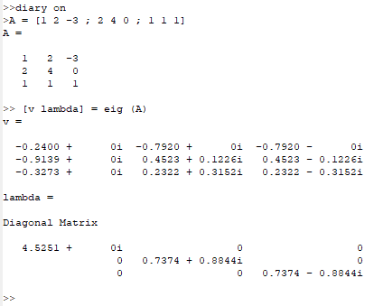
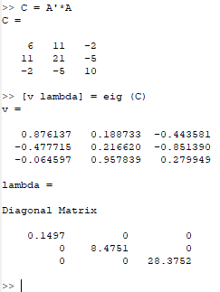
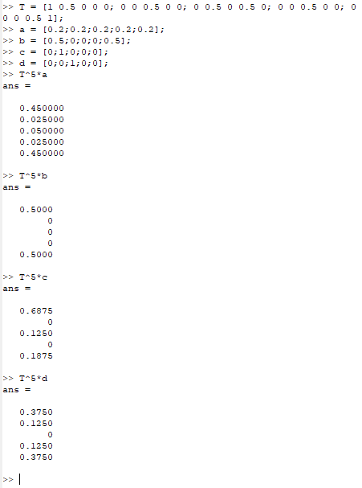
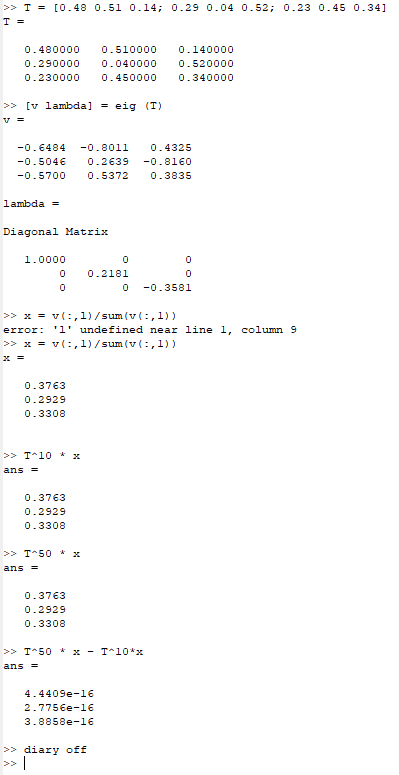

---
## Front matter
lang: ru-RU
title: Отчёт по лабораторной работе №8. Задача на собственные значения.
author: |
	Alexander S. Baklashov
institute: |
	RUDN University, Moscow, Russian Federation

date: 11 December, 2023

## Formatting
toc: false
slide_level: 2
theme: metropolis
header-includes: 
 - \metroset{progressbar=frametitle,sectionpage=progressbar,numbering=fraction}
 - '\makeatletter'
 - '\beamer@ignorenonframefalse'
 - '\makeatother'
aspectratio: 43
section-titles: true
---

# Цель работы

Изучить собственные значения в Octave.

# Выполнение лабораторной работы

## Собственные значения и собственные векторы

Зададим матрицу A. Найдём собственные значения и собственные векторы этой матрицы.

{ #fig:001 width=65% }

## Собственные значения и собственные векторы

Получим матрицу с действительными собственными значениями

{ #fig:002 width=45% }

## Марковские цепи. Случайное блуждание.

Найдём вектор вероятности после 5 шагов для каждого из начальных векторов вероятности.

{ #fig:003 width=40% }

## Марковские цепи. Случайное блуждание.

Найдём вектор равновесного состояния для цепи Маркова

{ #fig:004 width=30% }

# Выводы

В ходе данной лабораторной работы я изучил собственные значения в Octave.