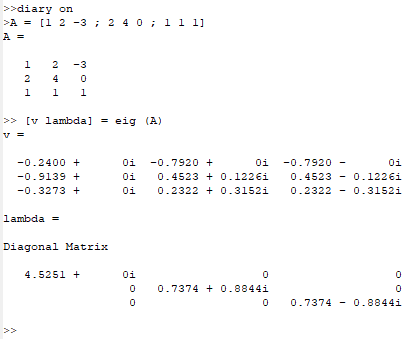
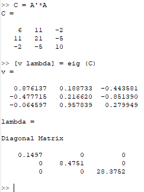
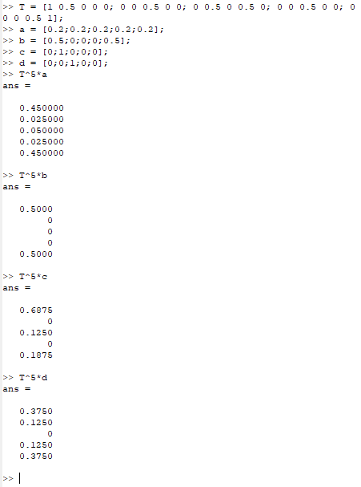
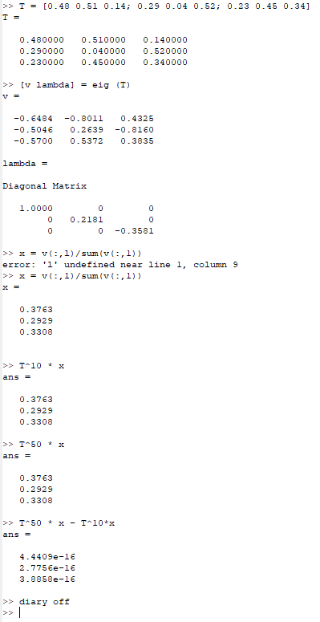

---
## Front matter
title: "Отчёт по лабораторной работе №8. Задача на собственные значения."
subtitle: "Предмет: научное программирование"
author: "Александр Сергеевич Баклашов"

## Generic otions
lang: ru-RU
toc-title: "Содержание"

## Bibliography
bibliography: bib/cite.bib
csl: pandoc/csl/gost-r-7-0-5-2008-numeric.csl

## Pdf output format
toc: true # Table of contents
toc-depth: 2
lof: true # List of figures
lot: true # List of tables
fontsize: 12pt
linestretch: 1.5
papersize: a4
documentclass: scrreprt
## I18n polyglossia
polyglossia-lang:
  name: russian
  options:
	- spelling=modern
	- babelshorthands=true
polyglossia-otherlangs:
  name: english
## I18n babel
babel-lang: russian
babel-otherlangs: english
## Fonts
mainfont: PT Serif
romanfont: PT Serif
sansfont: PT Sans
monofont: PT Mono
mainfontoptions: Ligatures=TeX
romanfontoptions: Ligatures=TeX
sansfontoptions: Ligatures=TeX,Scale=MatchLowercase
monofontoptions: Scale=MatchLowercase,Scale=0.9
## Biblatex
biblatex: true
biblio-style: "gost-numeric"
biblatexoptions:
  - parentracker=true
  - backend=biber
  - hyperref=auto
  - language=auto
  - autolang=other*
  - citestyle=gost-numeric
## Pandoc-crossref LaTeX customization
figureTitle: "Рис."
tableTitle: "Таблица"
listingTitle: "Листинг"
lofTitle: "Список иллюстраций"
lotTitle: "Список таблиц"
lolTitle: "Листинги"
## Misc options
indent: true
header-includes:
  - \usepackage{indentfirst}
  - \usepackage{float} # keep figures where there are in the text
  - \floatplacement{figure}{H} # keep figures where there are in the text
---

# Цель работы

Изучить собственные значения в Octave.

# Теоретическое введение

GNU Octave — свободная программная система для математических вычислений, использующая совместимый с MATLAB язык высокого уровня.

Предоставляет интерактивный командный интерфейс для решения линейных и нелинейных математических задач, а также проведения других численных экспериментов. Кроме того, Octave можно использовать для пакетной обработки. Язык Octave оперирует арифметикой вещественных и комплексных скаляров, векторов и матриц, имеет расширения для решения линейных алгебраических задач, нахождения корней систем нелинейных алгебраических уравнений, работы с полиномами, решения различных дифференциальных уравнений, интегрирования систем дифференциальных и дифференциально-алгебраических уравнений первого порядка, интегрирования функций на конечных и бесконечных интервалах. Этот список можно легко расширить, используя язык Octave (или используя динамически загружаемые модули, созданные на Си, C++, Фортране и других). [1]

# Выполнение лабораторной работы

## Собственные значения и собственные векторы

Зададим матрицу A. Необходимо найти собственные значения и собственные векторы этой матрицы. Для нахождения используется команда eig с двумя выходными аргументами. Синтаксис:

[v lambda] = eig (А)

Первый элемент результата есть матрица, столбцы которой представляют собой собственные векторы, а второй результат будет диагональной матрицей с собственными значениями на диагонали.(рис. [-@fig:001])

{ #fig:001 width=80% }

Для того, чтобы получить матрицу с действительными собственными
значениями, мы можем создать симметричную матрицу (имеющую
действительные собственные значения) путём умножения матрицы и
на транспонированную матрицу (рис. [-@fig:002])

{ #fig:002 width=90% }

## Марковские цепи. Случайное блуждание.

Предположим, что мы случайным образом передвигаемся следующим образом. В состояниях 2,3 или 4 мы перемещаемся влево или вправо наугад. По достижении конца дороги (состояния 1 или 5) мы останавливаемся. 

Наша цель - предсказать, где мы окажемся. Начнем с вектора вероятности.

- Предположим, что мы можем начать в любой точке с равной вероятностью. Тогда начальный вектор будет (0.2 ,0.2 ,0.2 ,0.2 ,0.2 ).

- С другой стороны, мы можем знать начальное состояние. Предположим, мы начинаем с состояния 3. Тогда начальный вектор будет (0,0,1,0,0).

Мы хотим предсказать наше местоположение после $k$ ходов. Это делается путём записи переходной матрицы. Сформируем массив $n x n$, элемент $ij$ которого является вероятностью перехода из состояния $i$ в $j$. Пусть $T$ есть транспонированная матрица переходов. Матричное
произведение $Tx$ даёт новое распределение вероятностей после одного периода времени. Продолжение умножения на $T$ даёт вероятности для будущих состояний. Таким образом, для любого начального вектора вероятности $x$ и любого положительного целого числа $k$ вектор
вероятности после $k$ периодов времени равен 

$$\vec{y} = T^k\vec{x}$$

Для примера случайного блуждания найдём вектор вероятности после 5 шагов для каждого из следующих начальных векторов вероятности:

$$a = [0.2\; 0.2 \;0.2\; 0.2 \;0.2]^T \\

b = [0.5\; 0 \;0 \;0 \;0.5]^T \\
c = [0 \;1 \;0 \;0\; 0]^T \\
d = [0 \;0 \;1 \;0 \;0]^T $$

Сформируем матрицу переходов:

$$
T=\left[\begin{array}{ccccc}
1 & 0.5 & 0 & 0 & 0 \\
0 & 0 & 0.5 & 0 & 0 \\
0 & 0.5 & 0 & 0.5 & 0 \\
0 & 0 & 0.5 & 0 & 0 \\
0 & 0 & 0 & 0.5 & 1
\end{array}\right]
$$

Вероятности будущего состояния легко вычисляются как $T^k\vec{x}$, где
$x$ - начальный вектор вероятностей (рис. [-@fig:003])

{ #fig:003 width=90% }

Состояние $x$ является равновесным, если $\vec{x} = T\vec{x}$, где $T$ - матрица
перехода для цепи Маркова. Равновесное состояние не приводит к
изменению состояния в будущем. Каждая цепь Маркова имеет хотя бы
одно равновесное состояние.
Пусть $T$ - матрица переходов для цепи Маркова. Тогда $\lambda = 1$ является
собственным значением $T$. Если $x$ является собственным вектором
для $\lambda = 1$ с неотрицательными компонентами, сумма которых равна
$1$, то $x$ является равновесным состоянием для $T$.
Найдём вектор равновесного состояния для цепи Маркова с переходной
матрицей
$$
T=\left[\begin{array}{ccc}
0.48 & 0.51 & 0.14 \\
0.29 & 0.04 & 0.52 \\
0.23 & 0.45 & 0.34 \\
\end{array}\right]
$$

Таким образом, $x = (0.37631\; 0.29287 \;0.33082)$ является вектором
равновесного состояния. Проверим это.

Все пункты выше - на рис. [-@fig:004].

{ #fig:004 width=70% }
# Вывод

В ходе данной лабораторной работы я изучил собственные значения в Octave.

# Библиография

1. Лабораторная работа №8. - 8 с. [Электронный ресурс]. М. URL: [Лабораторная работа №7.](https://esystem.rudn.ru/pluginfile.php/2089345/mod_resource/content/2/README.pdf) (Дата обращения: 11.12.2023).