---
## Front matter
lang: ru-RU
title: Отчёт по индивидуальному проекту. Этап 1.
author: |
	Alexander S. Baklashov
institute: |
	RUDN University, Moscow, Russian Federation

date: 21 September, 2023

## Formatting
toc: false
slide_level: 2
theme: metropolis
header-includes: 
 - \metroset{progressbar=frametitle,sectionpage=progressbar,numbering=fraction}
 - '\makeatletter'
 - '\beamer@ignorenonframefalse'
 - '\makeatother'
aspectratio: 43
section-titles: true
---

# Цель работы

- Установить необходимое программное обеспечение.

- Скачать шаблон темы сайта.

- Разместить его на хостинге git.

- Установить параметр для URLs сайта.

- Разместить заготовку сайта на GitHub pages.

# Выполнение лабораторной работы

## Загрузка заготовки для сайта

Скачаем заготовку для сайта

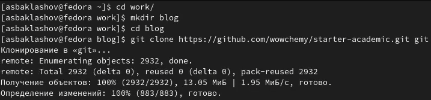{ #fig:001 width=80% }

## Проверим работу сайта

Запустим hugo server

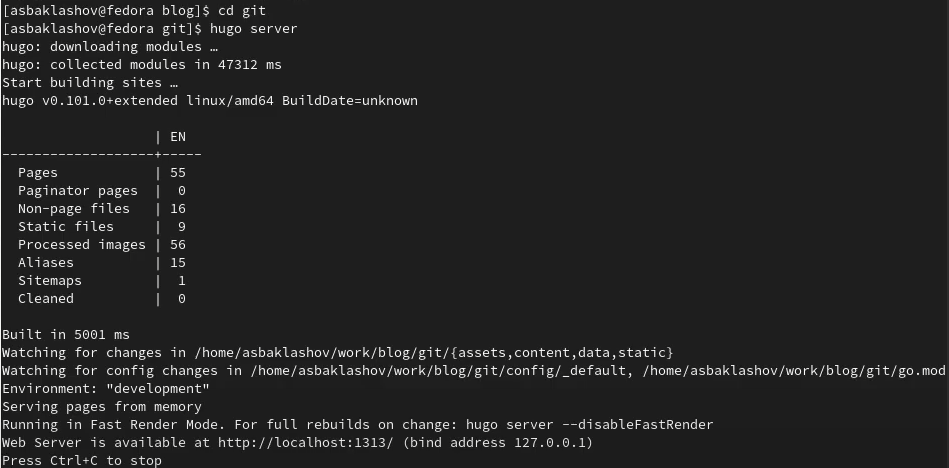{ #fig:002 width=90% }

## Проверим работу сайта

Откроем в локальном web-браузере http://localhost:1313/

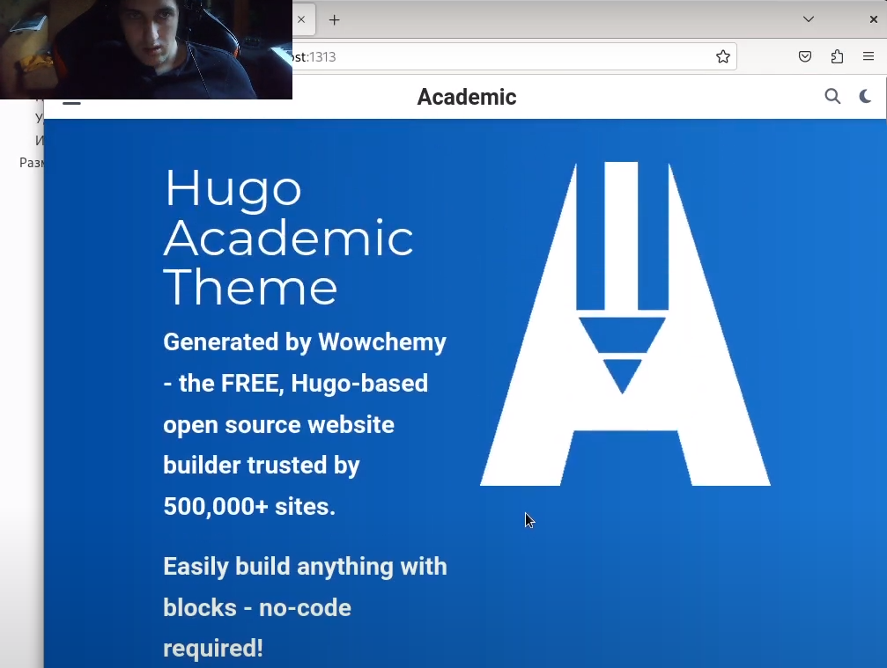{ #fig:003 width=70% }

## Удаление лишних файлов

Удалим лишние файлы

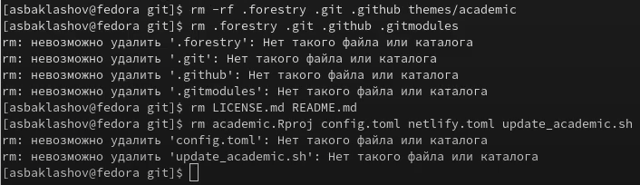{ #fig:004 width=70% }

## Инициируем git

Инициируем git

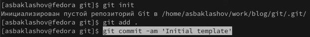{ #fig:005 width=90% }

## Размещение на хостинге

Создадим репозиторий blog

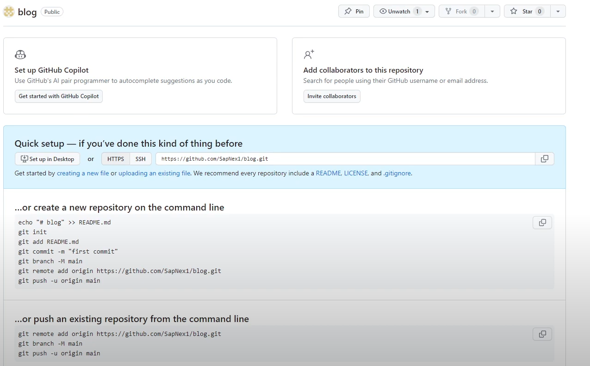{ #fig:006 width=90% }

## Размещение на хостинге

Создадим репозиторий sapnex1.github.io

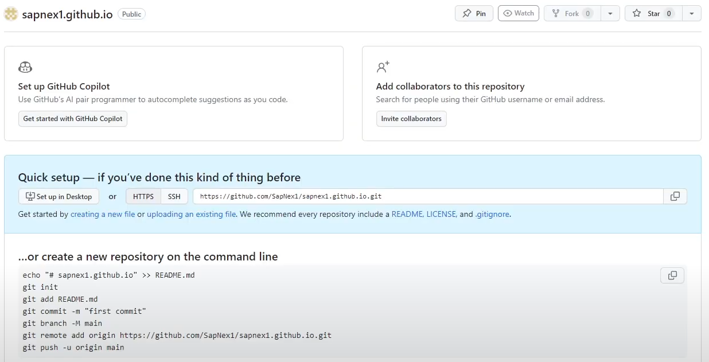{ #fig:007 width=90% }

## Загрузка репозитория на GitHub

Выложим свой репозиторий на GitHub

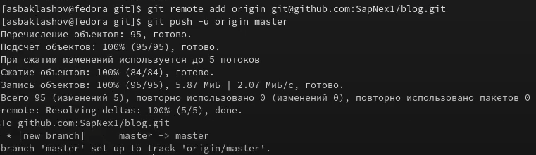{ #fig:008 width=90% }

## Настройка конфига

В файле config.yaml установим baseurl = "https://sapnex1.github.io/"

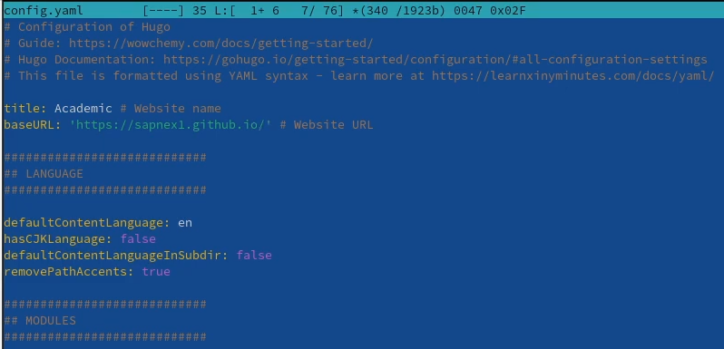{ #fig:009 width=90% }

## Загрузка конечного репозитория на GitHub

Добавим все в свой локальный репозиторий git и отправьте его в свой удаленный репозиторий на GitHub

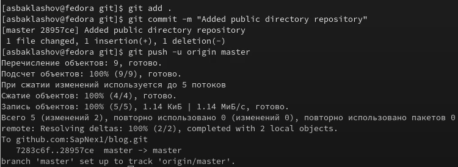{ #fig:010 width=90% }

## Обновление HTML-кода сайта

Обновим HTML-код сайта, запустив Hugo и загрузив общедоступный субмодуль в GitHub (рис. [-@fig:011])

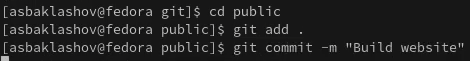{ #fig:011 width=90% }

## Обновление HTML-кода сайта

Отправим ветку master на удалённый репозиторий

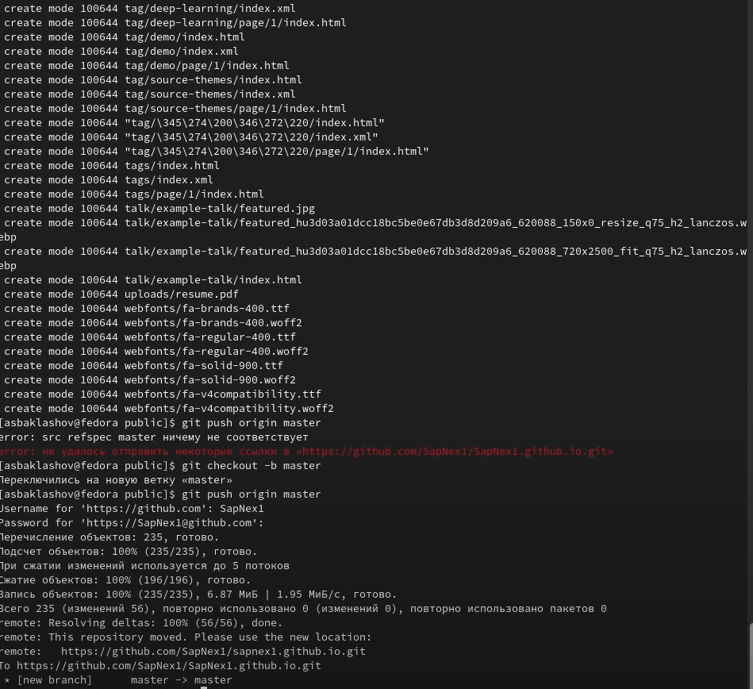{ #fig:012 width=65% }

## Запуск сайта

13. Запустим сайт по адресу https://sapnex1.github.io/ (рис. [-@fig:013])

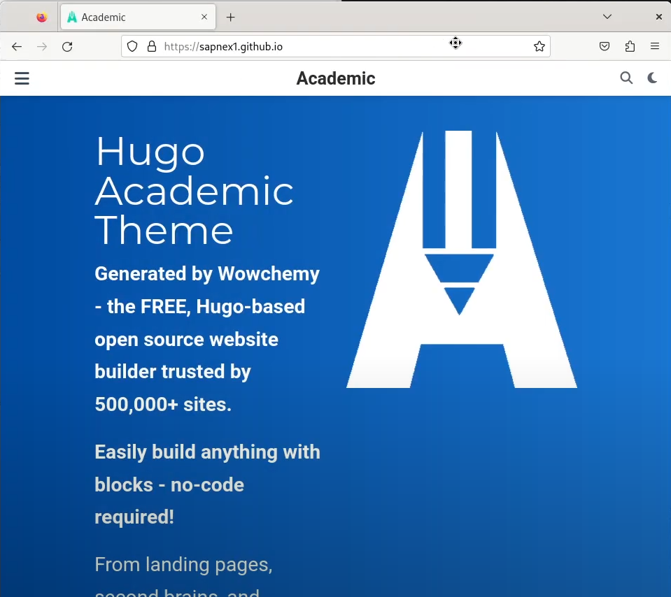{ #fig:013 width=70% }

# Выводы

В ходе данной лабораторной работы я:

- Установил необходимое программное обеспечение.

- Скачал шаблон темы сайта.

- Разместил его на хостинге git.

- Установил параметр для URLs сайта.

- Разместил заготовку сайта на GitHub pages. 