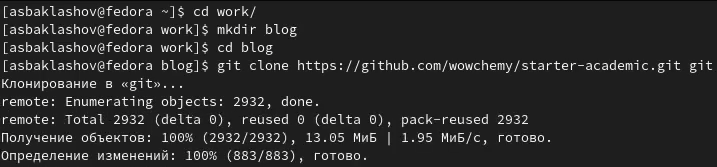
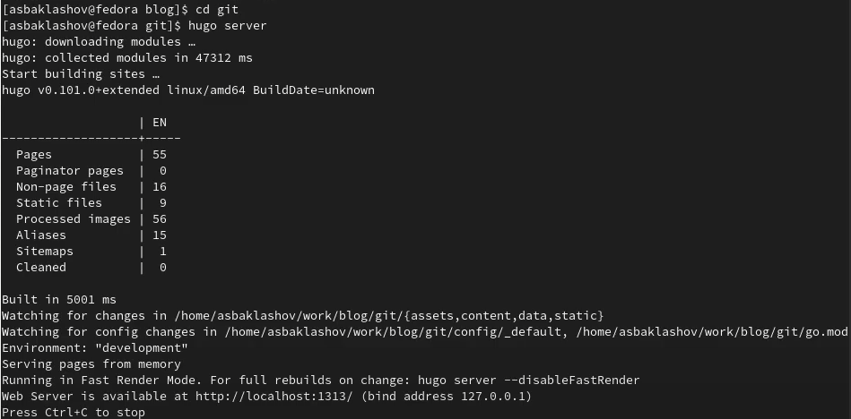
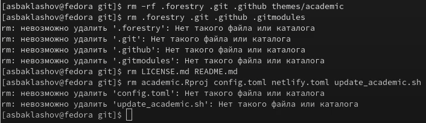
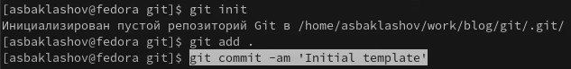
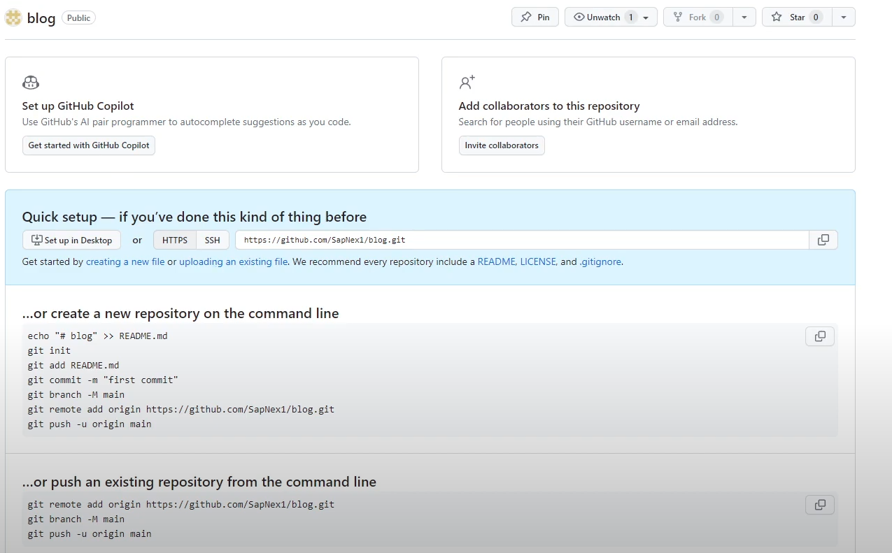
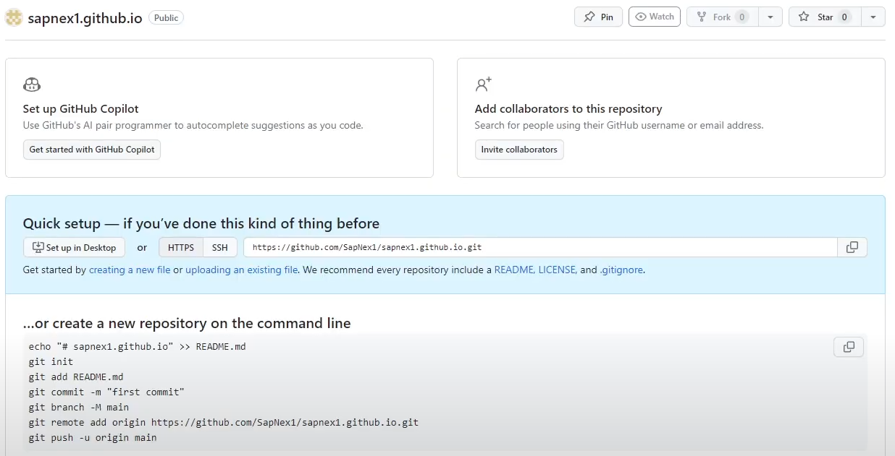
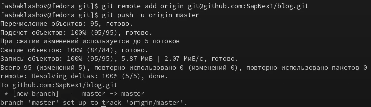
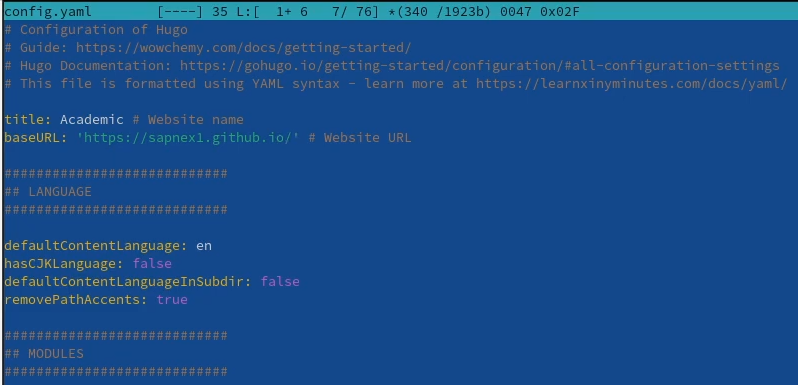
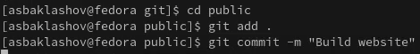
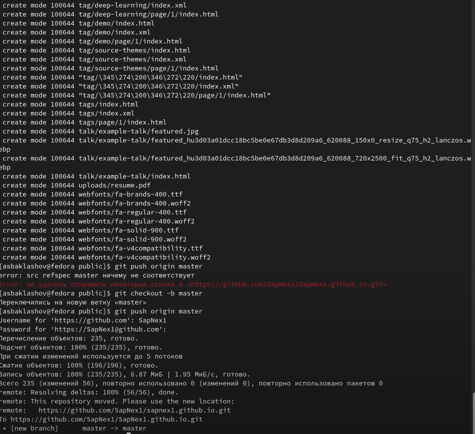

---
# Front matter
title: "Отчёт по индивидуальному проекту. Этап 1."
subtitle: "Предмет: научное программирование"
author: "Александр Сергеевич Баклашов"

# Generic otions
lang: ru-RU
toc-title: "Содержание"

# Bibliography
bibliography: bib/cite.bib
csl: pandoc/csl/gost-r-7-0-5-2008-numeric.csl

# References settings
linkReferences: true
nameInLink: true

# Pdf output format
toc: true # Table of contents
toc_depth: 2
lof: true # List of figures
lot: false # List of tables
fontsize: 12pt
linestretch: 1.5
papersize: a4
documentclass: scrreprt
## I18n
polyglossia-lang:
  name: russian
  options:
	- spelling=modern
	- babelshorthands=true
polyglossia-otherlangs:
  name: english
### Fonts
mainfont: PT Serif
romanfont: PT Serif
sansfont: PT Sans
monofont: PT Mono
mainfontoptions: Ligatures=TeX
romanfontoptions: Ligatures=TeX
sansfontoptions: Ligatures=TeX,Scale=MatchLowercase
monofontoptions: Scale=MatchLowercase,Scale=0.9
## Biblatex
biblatex: true
biblio-style: "gost-numeric"
biblatexoptions:
  - parentracker=true
  - backend=biber
  - hyperref=auto
  - language=auto
  - autolang=other*
  - citestyle=gost-numeric
## Misc options
indent: true
header-includes:
  - \linepenalty=10 # the penalty added to the badness of each line within a paragraph (no associated penalty node) Increasing the value makes tex try to have fewer lines in the paragraph.
  - \interlinepenalty=0 # value of the penalty (node) added after each line of a paragraph.
  - \hyphenpenalty=50 # the penalty for line breaking at an automatically inserted hyphen
  - \exhyphenpenalty=50 # the penalty for line breaking at an explicit hyphen
  - \binoppenalty=700 # the penalty for breaking a line at a binary operator
  - \relpenalty=500 # the penalty for breaking a line at a relation
  - \clubpenalty=150 # extra penalty for breaking after first line of a paragraph
  - \widowpenalty=150 # extra penalty for breaking before last line of a paragraph
  - \displaywidowpenalty=50 # extra penalty for breaking before last line before a display math
  - \brokenpenalty=100 # extra penalty for page breaking after a hyphenated line
  - \predisplaypenalty=10000 # penalty for breaking before a display
  - \postdisplaypenalty=0 # penalty for breaking after a display
  - \floatingpenalty = 20000 # penalty for splitting an insertion (can only be split footnote in standard LaTeX)
  - \raggedbottom # or \flushbottom
  - \usepackage{float} # keep figures where there are in the text
  - \floatplacement{figure}{H} # keep figures where there are in the text
---

# Цель работы

- Установить необходимое программное обеспечение.

- Скачать шаблон темы сайта.

- Разместить его на хостинге git.

- Установить параметр для URLs сайта.

- Разместить заготовку сайта на GitHub pages. [1]

# Теоретическое введение

Hugo is a static site generator written in Go. Steve Francia originally created Hugo as an open source project in 2013. Since v0.14 in 2015, Hugo has continued development under the lead of Bjørn Erik Pedersen with other contributors. Hugo is licensed under the Apache License 2.0.

Hugo is particularly noted for its speed, and Hugo's official website states it is "the world’s fastest framework for building websites". In July 2015, Netlify began providing Hugo hosting. Notable adopters are Smashing Magazine, which migrated from WordPress to a Jamstack solution with Hugo in 2017, and Cloudflare, which switched its Developer Docs from Gatsby to Hugo in 2022 [2]

# Выполнение индивидуального проекта

## Загрузка заготовки для сайта

1. Скачаем заготовку для сайта (рис. [-@fig:001])

{ #fig:001 width=80% }

## Проверим работу сайта

2. Запустим hugo server  (рис. [-@fig:002])

{ #fig:002 width=90% }

3. Откроем в локальном web-браузере http://localhost:1313/ (рис. [-@fig:003])

{ #fig:003 width=90% }

## Удаление лишних файлов

4. Удалим лишние файлы (рис. [-@fig:004])

{ #fig:004 width=70% }

## Инициируем git

5. Инициируем git (рис. [-@fig:005])

{ #fig:005 width=90% }

## Размещение на хостинге

6. Создадим репозиторий blog (рис. [-@fig:006])

{ #fig:006 width=90% }

7. Создадим репозиторий sapnex1.github.io (рис. [-@fig:007])

{ #fig:007 width=90% }

## Загрузка репозитория на GitHub

8. Выложим свой репозиторий на GitHub (рис. [-@fig:008])

{ #fig:008 width=90% }

## Настройка конфига

9. В файле config.yaml установим baseurl = "https://sapnex1.GitHub.io/". (рис. [-@fig:009])

{ #fig:009 width=90% }

## Загрузка конечного репозитория на GitHub

10. Добавим все в свой локальный репозиторий git и отправьте его в свой удаленный репозиторий на GitHub (рис. [-@fig:010])

{ #fig:010 width=90% }

## Обновление HTML-кода сайта

11. Обновим HTML-код сайта, загрузив общедоступный субмодуль в GitHub (рис. [-@fig:011])

{ #fig:011 width=90% }

12. Отправим ветку master на удалённый репозиторий (рис. [-@fig:012])

{ #fig:012 width=90% }

## Запустим сайт

13. Запустим сайт по адресу https://sapnex1.GitHub.io/ (рис. [-@fig:013])

{ #fig:013 width=90% }

# Вывод

В ходе данной лабораторной работы я:

- Установил необходимое программное обеспечение.

- Скачал шаблон темы сайта.

- Разместил его на хостинге git.

- Установил параметр для URLs сайта.

- Разместил заготовку сайта на GitHub pages. 

# Библиография

1. Этапы реализации проекта. [Электронный ресурс]. М. URL: [Этапы реализации проекта](https://esystem.rudn.ru/mod/page/view.php?id=1030694) (Дата обращения: 20.09.2023).
2. Hugo (software) [Электронный ресурс]. М. URL: [Hugo (software)](https://en.wikipedia.org/wiki/Hugo_(software)) (Дата обращения: 21.09.2023).
