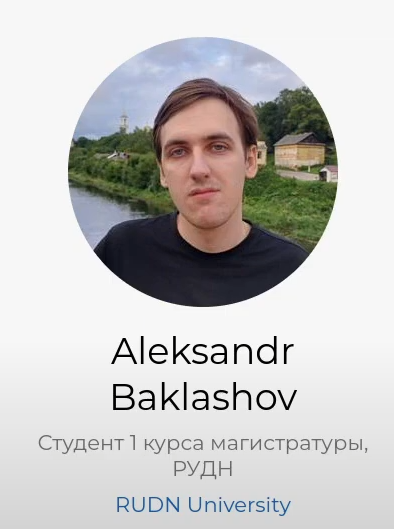
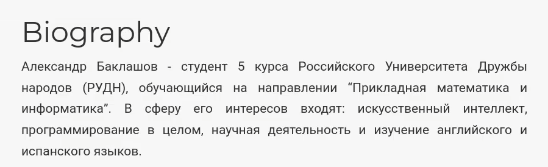
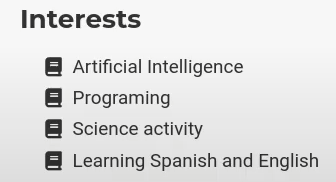
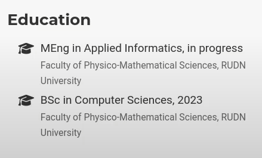
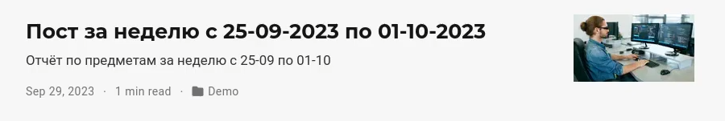
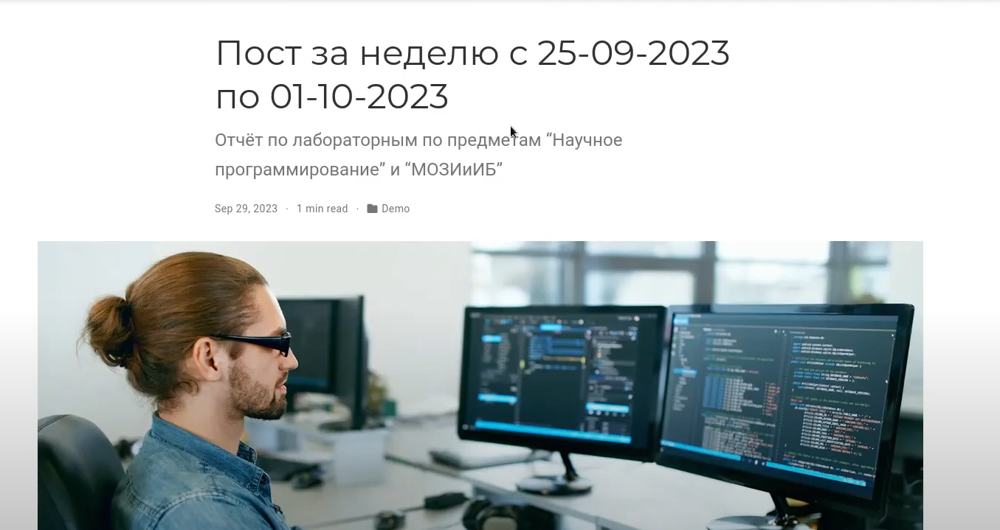
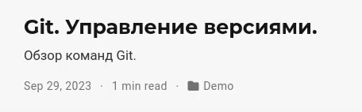
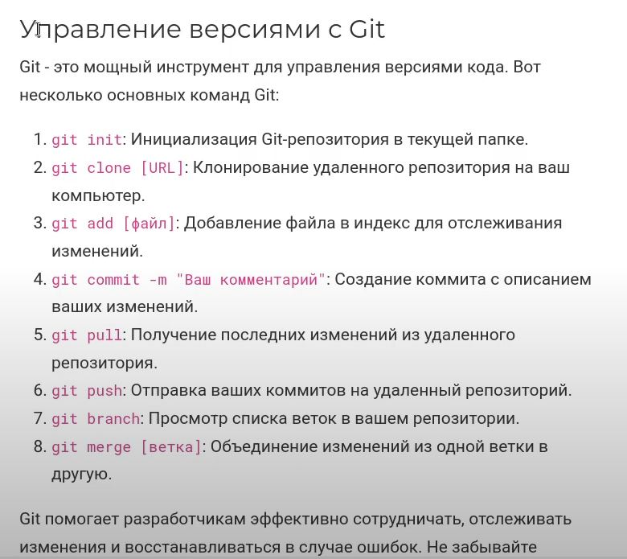

---
## Front matter
lang: ru-RU
title: Отчёт по индивидуальному проекту. Этап 2.
author: |
	Alexander S. Baklashov
institute: |
	RUDN University, Moscow, Russian Federation

date: 03 October, 2023

## Formatting
toc: false
slide_level: 2
theme: metropolis
header-includes: 
 - \metroset{progressbar=frametitle,sectionpage=progressbar,numbering=fraction}
 - '\makeatletter'
 - '\beamer@ignorenonframefalse'
 - '\makeatother'
aspectratio: 43
section-titles: true
---

# Цель работы

- Список добавляемых данных.

  - Разместить фотографию владельца сайта.

  - Разместить краткое описание владельца сайта (Biography).

  - Добавить информацию об интересах (Interests).

  - Добавить информацию об образовании (Education).

- Сделать пост по прошедшей неделе.

- Добавить пост на тему Управление версиями. Git.

# Выполнение лабораторной работы

## Размещение фотографии владельца сайта

Разместим фотографию владельца сайта 

{ #fig:001 width=45% }

## Размещение краткого описания владельца сайта (Biography).

Разместим краткое описание владельца сайта (Biography)

{ #fig:002 width=90% }

## Добавление информации об интересах (Interests)

Добавим информацию об интересах (Interests)

{ #fig:003 width=90% }

## Добавление информации об образовании (Education).

Добавим информацию об образовании

{ #fig:004 width=70% }

## Создание поста по прошедшей неделе.

Сделаем пост по прошедшей неделе. 

{ #fig:005 width=90% }

## Создание поста по прошедшей неделе.

Пост при открытии

{ #fig:006 width=90% }

## Добавление поста на тему Управление версиями. Git.

Добавим пост на тему Управление версиями. Git.

{ #fig:007 width=90% }

## Добавление поста на тему Управление версиями. Git.

Пост при открытии

{ #fig:008 width=60% }

# Выводы

В ходе данной лабораторной работы я:

  - Разместил фотографию владельца сайта.

  - Разместил краткое описание владельца сайта (Biography).

  - Добавил информацию об интересах (Interests).

  - Добавил информацию об образовании (Education).

- Сделал пост по прошедшей неделе.

- Добавил пост на тему Управление версиями. Git.