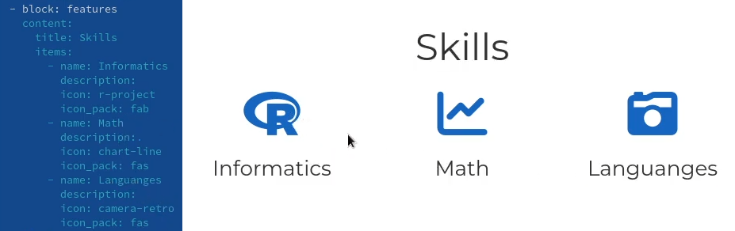
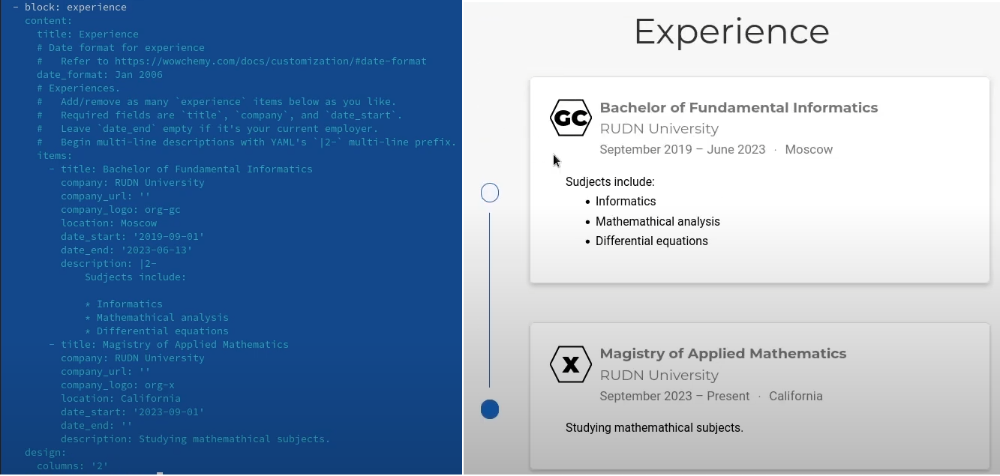
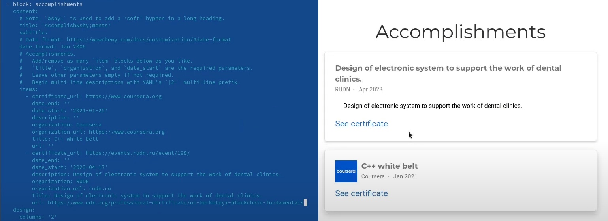
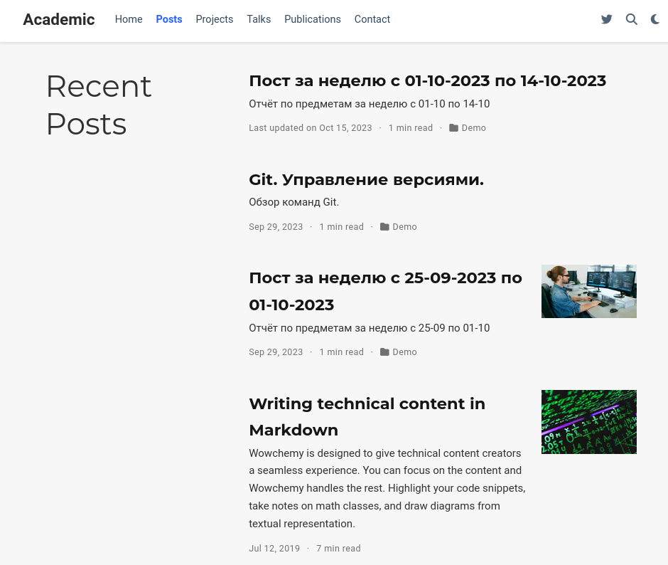
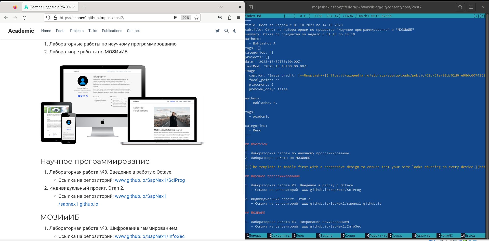
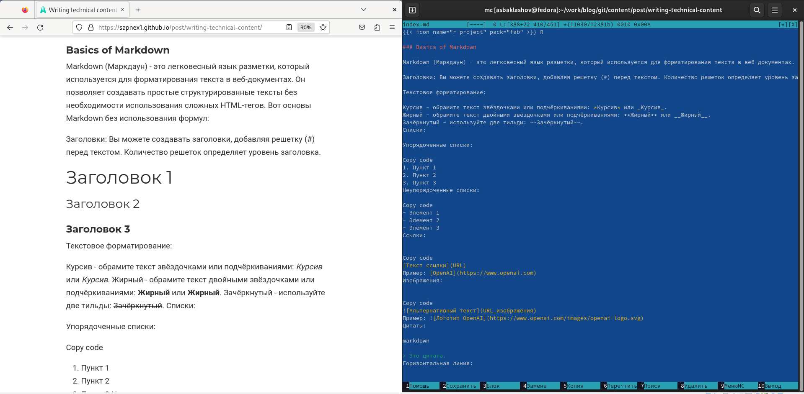

---
## Front matter
lang: ru-RU
title: Отчёт по индивидуальному проекту. Этап 3.
author: |
	Alexander S. Baklashov
institute: |
	RUDN University, Moscow, Russian Federation

date: 18 October, 2023

## Formatting
toc: false
slide_level: 2
theme: metropolis
header-includes: 
 - \metroset{progressbar=frametitle,sectionpage=progressbar,numbering=fraction}
 - '\makeatletter'
 - '\beamer@ignorenonframefalse'
 - '\makeatother'
aspectratio: 43
section-titles: true
---

# Цель работы

Добавить к сайту достижения.

- Список достижений.

  - Добавить информацию о навыках (Skills).

  - Добавить информацию об опыте (Experience).

  - Добавить информацию о достижениях (Accomplishments).

- Сделать пост по прошедшей неделе.

- Добавить пост на тему Язык разметки Markdown.

# Выполнение лабораторной работы

## Добавление информации о навыках

Добавим информацию о навыках

{ #fig:001 width=80% }

## Добавление информации об опыте

Добавим информацию об опыте

{ #fig:002 width=90% }

## Добавление информации о достижениях 

Добавим информацию о достижениях 

{ #fig:003 width=90% }

## Посты

Все посты на сайте 

{ #fig:004 width=70% }

## Создание поста по прошедшей неделе.

Сделаем пост по прошедшей неделе. 

{ #fig:005 width=90% }

## Добавление поста на тему Язык разметки Markdown.

Добавим пост на тему Язык разметки Markdown 

{ #fig:006 width=90% }

# Выводы

В ходе данной лабораторной работы я:

  - Добавил информацию о навыках (Skills).

  - Добавил информацию об опыте (Experience).

  - Добавил информацию о достижениях (Accomplishments).

- Сделал пост по прошедшей неделе.

- Добавил пост на тему Язык разметки Markdown.