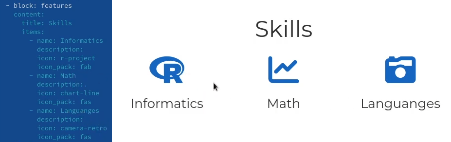
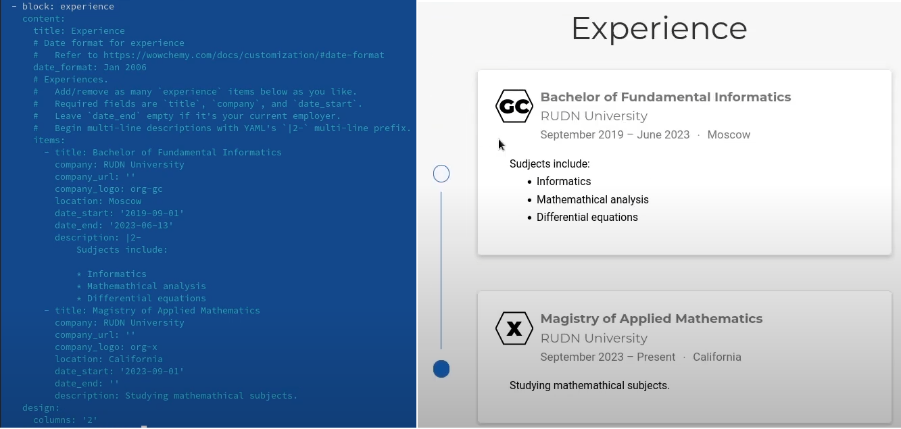
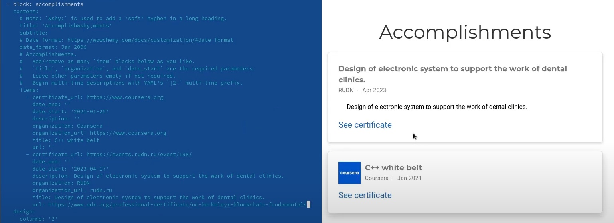
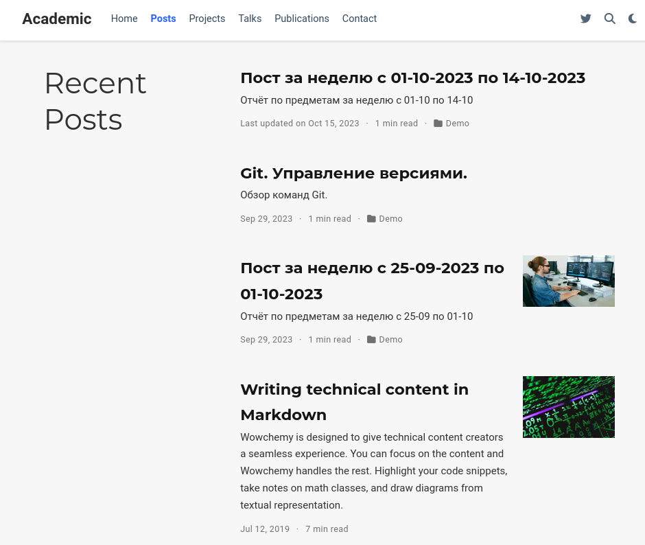
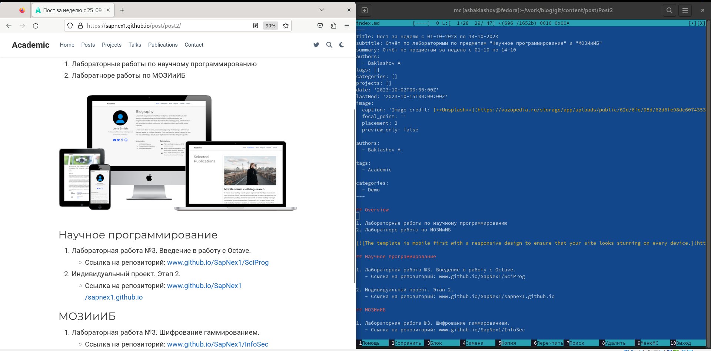

---
# Front matter
title: "Отчёт по индивидуальному проекту. Этап 3."
subtitle: "Предмет: научное программирование"
author: "Александр Сергеевич Баклашов"

# Generic otions
lang: ru-RU
toc-title: "Содержание"

# Bibliography
bibliography: bib/cite.bib
csl: pandoc/csl/gost-r-7-0-5-2008-numeric.csl

# References settings
linkReferences: true
nameInLink: true

# Pdf output format
toc: true # Table of contents
toc_depth: 2
lof: true # List of figures
lot: false # List of tables
fontsize: 12pt
linestretch: 1.5
papersize: a4
documentclass: scrreprt
## I18n
polyglossia-lang:
  name: russian
  options:
	- spelling=modern
	- babelshorthands=true
polyglossia-otherlangs:
  name: english
### Fonts
mainfont: PT Serif
romanfont: PT Serif
sansfont: PT Sans
monofont: PT Mono
mainfontoptions: Ligatures=TeX
romanfontoptions: Ligatures=TeX
sansfontoptions: Ligatures=TeX,Scale=MatchLowercase
monofontoptions: Scale=MatchLowercase,Scale=0.9
## Biblatex
biblatex: true
biblio-style: "gost-numeric"
biblatexoptions:
  - parentracker=true
  - backend=biber
  - hyperref=auto
  - language=auto
  - autolang=other*
  - citestyle=gost-numeric
## Misc options
indent: true
header-includes:
  - \linepenalty=10 # the penalty added to the badness of each line within a paragraph (no associated penalty node) Increasing the value makes tex try to have fewer lines in the paragraph.
  - \interlinepenalty=0 # value of the penalty (node) added after each line of a paragraph.
  - \hyphenpenalty=50 # the penalty for line breaking at an automatically inserted hyphen
  - \exhyphenpenalty=50 # the penalty for line breaking at an explicit hyphen
  - \binoppenalty=700 # the penalty for breaking a line at a binary operator
  - \relpenalty=500 # the penalty for breaking a line at a relation
  - \clubpenalty=150 # extra penalty for breaking after first line of a paragraph
  - \widowpenalty=150 # extra penalty for breaking before last line of a paragraph
  - \displaywidowpenalty=50 # extra penalty for breaking before last line before a display math
  - \brokenpenalty=100 # extra penalty for page breaking after a hyphenated line
  - \predisplaypenalty=10000 # penalty for breaking before a display
  - \postdisplaypenalty=0 # penalty for breaking after a display
  - \floatingpenalty = 20000 # penalty for splitting an insertion (can only be split footnote in standard LaTeX)
  - \raggedbottom # or \flushbottom
  - \usepackage{float} # keep figures where there are in the text
  - \floatplacement{figure}{H} # keep figures where there are in the text
---

# Цель работы

Добавить к сайту достижения.

- Список достижений.

  - Добавить информацию о навыках (Skills).

  - Добавить информацию об опыте (Experience).

  - Добавить информацию о достижениях (Accomplishments).

- Сделать пост по прошедшей неделе.

- Добавить пост на тему Язык разметки Markdown. [1]

# Теоретическое введение

Hugo is a static site generator written in Go. Steve Francia originally created Hugo as an open source project in 2013. Since v0.14 in 2015, Hugo has continued development under the lead of Bjørn Erik Pedersen with other contributors. Hugo is licensed under the Apache License 2.0.

Hugo is particularly noted for its speed, and Hugo's official website states it is "the world’s fastest framework for building websites". In July 2015, Netlify began providing Hugo hosting. Notable adopters are Smashing Magazine, which migrated from WordPress to a Jamstack solution with Hugo in 2017, and Cloudflare, which switched its Developer Docs from Gatsby to Hugo in 2022 [2]

# Выполнение индивидуального проекта

## Добавление информации о навыках

1. Добавим информацию о навыках (рис. [-@fig:001])

{ #fig:001 width=80% }

## Добавление информации об опыте

2. Добавим информацию об опыте (рис. [-@fig:002])

{ #fig:002 width=90% }

## Добавление информации о достижениях 

3. Добавим информацию о достижениях (рис. [-@fig:003])

{ #fig:003 width=90% }

## Посты

4. Все посты на сайте (рис. [-@fig:004])

{ #fig:004 width=70% }

## Создание поста по прошедшей неделе.

5. Сделаем пост по прошедшей неделе. (рис. [-@fig:005])

{ #fig:005 width=90% }

## Добавление поста на тему Язык разметки Markdown.

6. Добавим пост на тему Язык разметки Markdown (рис. [-@fig:006])

{ #fig:006 width=90% }

# Вывод

В ходе данной лабораторной работы я:

  - Добавил информацию о навыках (Skills).

  - Добавил информацию об опыте (Experience).

  - Добавил информацию о достижениях (Accomplishments).

- Сделал пост по прошедшей неделе.

- Добавил пост на тему Язык разметки Markdown.

# Библиография

1. Этапы реализации проекта. [Электронный ресурс]. М. URL: [Этапы реализации проекта](https://esystem.rudn.ru/mod/page/view.php?id=1030694) (Дата обращения: 18.10.2023).
2. Hugo (software) [Электронный ресурс]. М. URL: [Hugo (software)](https://en.wikipedia.org/wiki/Hugo_(software)) (Дата обращения: 18.10.2023).
